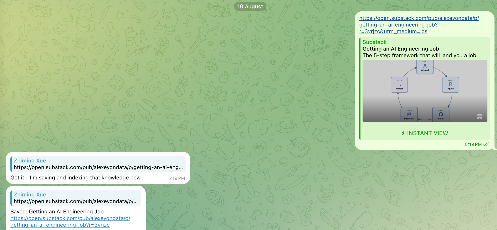
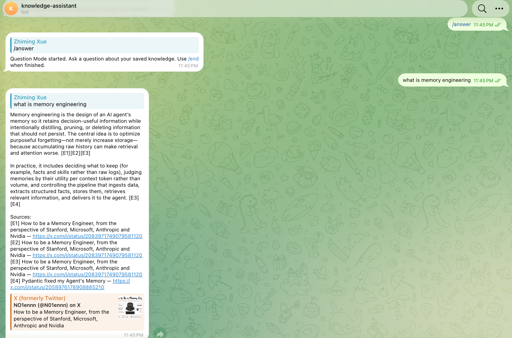
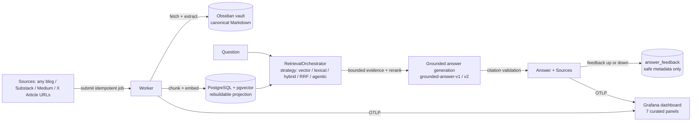

# Knowledge Assistant

A personal knowledge engine that saves long-form articles (blog posts,
Substack, Medium, X Articles) as canonical Markdown in your own Obsidian vault
and answers questions with grounded, cited answers from your saved knowledge —
through a Telegram bot, a non-Telegram CLI demo, and a reproducible
evaluation/benchmark harness.

## Who this is for

You read a lot of long-form content (essays, newsletters, tech articles) and
keep losing the specifics: *"what did that essay say about X?"* You want a
personal assistant that answers **from what you actually saved** — with citations
back to the exact article — not from whatever the model remembers about the
internet.

## The problem and why generic ChatGPT isn't enough

Generic chat models answer from their training data, which:

- has **no memory of the specific articles you saved**;
- **hallucinates plausible-but-wrong details** about niche essays and authors;
- cannot **cite the exact source** for a claim;
- does not improve as **your** knowledge base grows.

Knowledge Assistant inverts this: your vault is the single source of truth, and
every answer is generated from retrieved evidence with validated citation
markers. If the knowledge base does not contain the answer, it says so instead
of guessing.

## What it does

- **Saves** public blog posts, Substack, Medium, and rich X Articles as canonical
  Markdown in an Obsidian vault (X Articles are Article-only via Xquik, with
  strict lossless-block validation; anything lossy fails explicitly).
  
- **Indexes** every saved document into a rebuildable PostgreSQL projection
  (dense embeddings + full-text) scoped to a projection generation.
- **Answers** questions with a grounded, cited answer through five selectable
  retrieval strategies (`weighted-hybrid-v1` is the production default).
    
- **Evaluates** retrieval and end-to-end answers against a committed, curated,
  public-safe sample dataset — with real, reproducible numbers.
  Evaluation target validation is chunk-level (chunk id + content fingerprint)
  whenever a case carries a target chunk; document-level URL resolution is used
  only as the fallback for no-target cases. The committed sample dataset is
  document-level, so its answers are validated by document and cited evidence
  resolution — the project does not claim chunk-level citation support for that
  run.
- **Monitors** ingestion, questions, citations, and feedback on a curated
  Grafana dashboard.

## Supported sources

| Source | Provider | Notes |
| --- | --- | --- |
| Any public blog/article page | `web` | static HTML pages from any HTTPS site |
| Substack essays | `substack` | including `.substack.com` publications |
| Medium articles | `medium` | with a bounded RSS fallback for HTTP 403 |
| X Articles | `xquik_mpp` / `xquik` | Article-only; ordinary posts/threads fail clearly |

## Architecture



## Sample dataset (committed, public-safe)

`data/sample/manifest.json` is a reproducible, public-safe sample corpus: four
public Substack essays (Addy Osmani's *21 Lessons from 14 Years at Google* and
*Software Factories, Light and Dark*; Kent Beck's *Is Source Code Going Away?*
and *The Pinhole View of AI Value*) with **titles and URLs only — no article
bodies** — plus 25 curated questions with reference answers and
required facts, including three insufficient-evidence cases and a deliberate
mix of single-document, explanation, exact-lookup, comparison, multi-document
synthesis, follow-up-style, and hard-negative questions. All four URLs were
verified publicly fetchable in August 2026. See
[data/sample/README.md](./data/sample/README.md).

## Ingestion walkthrough

1. A source URL is submitted (Telegram message, `sample-ingest`, `demo ingest`,
   or the optional Prefect flow `prefect-ingest`).
2. The worker classifies the URL, fetches the public article, extracts it to
   canonical Markdown, and writes it into the Obsidian vault (plus
   content-addressed image assets).
3. The worker chunks the Markdown deterministically, embeds each chunk, and
   writes rebuildable projection rows into PostgreSQL, scoped to a projection
   generation.
4. The vault Markdown remains the source of truth; every PostgreSQL row is a
   disposable projection that can be rebuilt with `projection-rebuild` and
   activated atomically with `projection-activate`.

## Retrieval and answering walkthrough

1. `demo ask --question "…"` (or Telegram Question Mode) embeds the question.
2. The selected strategy retrieves candidate chunks from the active projection
   generation (semantic, lexical via PostgreSQL `ts_rank_cd`, weighted hybrid,
   RRF hybrid, or bounded agentic decomposition).
3. A deterministic diversity reranker bounds the context.
4. A structured answer generator produces the answer with citation markers
   (the configured `grounded-answer-v2` production default; `grounded-answer-v1`
   remains available only as an explicit baseline override).
5. A deterministic validator rejects answers whose citations do not resolve to
   the retrieved evidence; the rendered answer includes a `Sources:` section.

## Setup

Requirements: Python 3.12+ (uv recommended), Docker Desktop for the full stack,
and an Obsidian vault directory (a local folder is enough; no Obsidian API
token needed).

```shell
uv sync --extra dev --extra orchestration   # include the optional Prefect extra
PYTHONPATH=src uv run pytest
docker compose config --quiet
docker compose up -d --build
```

> **macOS local note:** the local `.venv` editable-install marker can receive the
> macOS `UF_HIDDEN` flag, which CPython's `site` module silently skips, breaking
> bare `uv run pytest`/`uv run mypy` with `ModuleNotFoundError`. Use the reliable
> invocation `PYTHONPATH=src uv run pytest` and `MYPYPATH=src uv run mypy` (or
> `uv sync --no-editable` to avoid the marker entirely). The Docker test image
> runs plain `pytest` with no workaround.
>
> One integration test (`test_lexical_retrieval.py`) needs a live database whose
> projection contains the committed sample corpus (ingest it with the
> `sample-ingest` CLI command). Without it — or without any database — the test
> skips automatically; everything else runs hermetically.

### Environment and credentials

Copy `.env.example` to `.env` and fill in only what you use. Required: the
PostgreSQL connection (from the compose stack) and `KNOWLEDGE_ASSISTANT_VAULT_PATH`.
Optional components are marked `[optional]` in `.env.example`:

- **Answer prompt** (`KNOWLEDGE_ASSISTANT_ANSWER_PROMPT_VERSION`): production
  default `grounded-answer-v2` (the evaluated, stricter per-sentence grounding
  prompt); `grounded-answer-v1` only as an explicit baseline override.
- **OpenAI** (`OPENAI_API_KEY`, generation/embedding models): required for
  embedding, answering, and evaluation. Sign up at platform.openai.com
  (pay-per-use; small demo runs cost cents).
- **Telegram** (`TELEGRAM_TOKEN`, numeric `TELEGRAM_ALLOWED_USER_IDS`): an
  optional single-user client; required only for the bot, which runs under the
  explicit `telegram` Compose profile (`docker compose --profile telegram up -d bot`).
  The core engine, ingestion worker, CLI demo, and Prefect ingestion all run
  without it. Create a bot with @BotFather; use your numeric user id.
- **X Articles** (`X_ARTICLE_PROVIDER`): Tempo MPP (authorize with
  `tempo-auth`) or an Xquik API key; costs ~$0.00075 per Article.
- **Monitoring** (`OTEL_EXPORTER_OTLP_ENDPOINT=http://lgtm:4318`): optional
  Grafana dashboard.

Never commit `.env`. Secrets are never printed by `check-config` or telemetry.

### Which commands cost money

Pure setup (free): `migrate`, `check-config`, `sample-ingest`, `demo ingest`,
`sample-eval-prepare`.
Model calls (small pay-per-use): `demo ask`, `eval-run`, `eval-generate`,
`answer-eval-run`, `projection-rebuild` (embeds the whole corpus, so it incurs
embedding model usage — it is not a free command), and the worker's embedding
step.

## Reviewer quick start (no Telegram required)

```shell
# 1. Start the core stack (PostgreSQL + migration + worker only; no Telegram)
docker compose up -d --build postgres migrate worker

# 2. Ingest the public sample corpus (notification-free)
docker compose --profile tools run --rm admin demo ingest

# 3. Ask a real question through the full RAG path
docker compose --profile tools run --rm admin \
  demo ask --question "What do engineers actually need to get good at?"
```

Example output (real run, `weighted-hybrid-v1`, synthetic model-generated answer,
truncated; not a source excerpt):

> According to the essay, engineers need to become good at far more than
> programming: they need to navigate the surrounding human and organizational
> work. [E1]
>
> In practical terms, the essay emphasizes getting good at: deeply understanding
> and solving user problems... [E3] working effectively with people... [E2]
>
> Sources:
> [E1] 21 Lessons from 14 Years at Google — https://addyo.substack.com/p/21-lessons-from-14-years-at-google
> [E2] 21 Lessons from 14 Years at Google — https://addyo.substack.com/p/21-lessons-from-14-years-at-google
> [E3] 21 Lessons from 14 Years at Google — https://addyo.substack.com/p/21-lessons-from-14-years-at-google

Optional Prefect orchestration (thin flow reusing the same ingestion contract,
never replaces the worker):

```shell
docker compose --profile tools run --rm prefect-ingest
```

## Evaluation

All scores below are **real output** from runs against the committed
`sample-docs-v1` dataset on projection `bd3a3ba7-…` (`text-embedding-3-small`,
1536 dims). Nothing is fabricated; every benchmark command is reproducible with
the `knowledge-assistant` CLI.

### Retrieval (25 cases, 5 strategies)

Real rerun 2026-08-17 after expanding the dataset from 8 to 25 curated
questions (3 insufficient-evidence cases excluded from Hit@K/MRR and reported
via the no-answer false-positive metric):

| Strategy | Hit@5 | Hit@20 | MRR | Latency | Planner calls | No-answer false-positive |
| --- | --- | --- | --- | --- | --- | --- |
| vector-only-v1 | 1.000 | 1.000 | 0.871 | 0.61s | 0 | 0.333 |
| lexical-only-v1 | 0.773 | 0.909 | 0.656 | 0.48s | 0 | 0.667 |
| **weighted-hybrid-v1 (default)** | **0.909** | **1.000** | **0.814** | **0.47s** | 0 | 0.667 |
| rrf-hybrid-v1 | 0.909 | 1.000 | 0.848 | 0.45s | 0 | 0.333 |
| agentic-decomposition-v1 | 0.955 | 1.000 | 0.873 | 2.45s | 1 | 0.333 |

No-answer cases are excluded from Hit@K and MRR; they are reported through the
false-positive metric instead (several strategies surface the distractor
document for the hard-negative no-answer cases, which the answer layer must
abstain on — `grounded-answer-v2` abstains on 2 of 3). Applying the
pre-registered policy, **no candidate satisfies all four gates**, so
`weighted-hybrid-v1` stays the production default: `vector-only-v1` clears
aggregate quality (+0.091 Hit@5, +0.057 MRR), latency (1.31x), cost, and
operational complexity (and improves no-answer false positives, 0.333 vs 0.667)
but regresses the exact_lookup slice MRR (1.000 → 0.833, −0.167, beyond the
0.01 per-slice tolerance, driven by `sample-q-09` ranking position 3 vs 1);
`rrf-hybrid-v1` ties Hit@5 (0.909, not +0.02); `agentic-decomposition-v1` fails
latency (≈5.2x) and adds planner cost; `lexical-only-v1` fails aggregate
quality (Hit@5 0.773). Full breakdowns:
[data/sample/benchmark-summary.md](./data/sample/benchmark-summary.md).

### End-to-end answer evaluation (25 cases, weighted-hybrid-v1)

Real rerun 2026-08-17 with a structured LLM judge applied
(`answer-judge-rubric-v1`, uncalibrated model opinions — see below):

| Approach | Citation validity | Citation coverage | No-answer abstention | Unexpected abstention | Judge overall | Mean latency | Mean tokens (in/out) |
| --- | --- | --- | --- | --- | --- | --- | --- |
| grounded-answer-v1 (baseline) | 96% | 0.36 | 0% | 13.6% | 2.56 | 3.88s | 4367 / 154 |
| grounded-answer-v2 (default) | 100% | **0.48** | **66.7%** | **9.1%** | **2.92** | **3.50s** | 3447 / 120 |

Metric definitions (deterministic, per the evaluation runner): **No-answer
abstention rate** = fraction of insufficient-evidence (no-answer) cases in which
the answer abstained (`sufficient_evidence=false`); **Unexpected abstention
rate** = fraction of answerable cases in which the answer abstained despite
retrieved evidence (an over-cautious answer). Generation is nondeterministic, so
per-run numbers vary slightly; the table reflects the recorded run.

`grounded-answer-v2` (per-sentence citation markers + explicit abstention
policy) improves citation validity, citation coverage, abstention, and judge
overall over v1 with fewer tokens and lower latency. It is the configured
production default (`KNOWLEDGE_ASSISTANT_ANSWER_PROMPT_VERSION`, used by
Telegram Question Mode and `demo ask`); `grounded-answer-v1` remains the
explicit baseline for `answer-eval-run` and ad-hoc override runs. Full
breakdowns: [data/sample/answer-benchmark-summary.md](./data/sample/answer-benchmark-summary.md).
Historical `synthetic-chunks-v1` scores are **biased and superseded** (v1
generated each question from its own target chunk) and are not presented as
evidence.

**Metric separation and calibration status.** The answer evaluation separates
deterministic metrics (citation validity/coverage, required-fact **lexical**
coverage — a token-overlap proxy, never presented as semantic factual
correctness — abstention, latency, tokens) from **model-judge scores** (the
structured `answer-judge-rubric-v1` scores above) and from **human labels**
(reviewed labels belong in `data/sample/answer-human-labels.jsonl`). Calibration
of the judge against human labels is **`not_run`** (no human labels reviewed
yet; nothing is fabricated). Until a human scores a subset and
`answer-eval-calibrate` reports per-dimension MAE/bias/correlation, the judge
scores are **uncalibrated model opinions**, not ground truth. The exact
procedure is in [data/sample/README.md](./data/sample/README.md).

**Validation mode:** the committed sample dataset (`sample-docs-v1`) carries no
target chunks — its cases are document-level, so this run validated targets by
resolved document URL, and citation validity means every cited identifier
resolves to retrieved evidence (not target-document membership). The evaluation
runner's primary path is chunk-level: cases that carry a target chunk are
validated by chunk id + content fingerprint (`validate_chunk`), with the
document-level URL check retained only as the fallback for no-target cases. The
runner does not claim chunk-level citation support for the document-level sample
run.

## Monitoring and feedback

The bot supports `/answer` Question Mode and `/feedback up` / `/feedback down`.
Feedback is idempotent (one vote per turn per user) and **durable**: it
survives `/end` and session expiry, while the temporary conversation content is
still deleted. It stores **only safe metadata** (direction, an opaque turn
reference, retrieval strategy, projection generation, generation model, answer
prompt version, timestamp) — never the question, answer, URLs, evidence,
prompts, or tokens — and feeds the `feedback_total` metric. The curated
**Knowledge Assistant** Grafana dashboard (7 panels: questions by outcome,
question latency, retrieval candidates, ingestion jobs/duration, citation
outcomes, feedback) is provisioned automatically from `config/grafana/` via
Docker Compose. The dashboard is provisioned automatically from
`config/grafana/`.

## Limitations

- Sources are limited to publicly fetchable article pages; paywalled or
  JavaScript-only pages fail with explicit errors (Medium has an RSS fallback).
- JavaScript-rendered blogs have no extractable static HTML and fail at the
  quality gate rather than ingesting garbage.
- The committed benchmark is a 25-case sample over 4 documents; scores are
  indicative, not statistically significant, and the retrieval default stays
  `weighted-hybrid-v1` until a larger independently reviewed dataset supports a
  change.
- The structured LLM judge was applied in the recorded run, but its scores are
  **uncalibrated model opinions** until a human reviews a label subset and
  `answer-eval-calibrate` reports agreement; calibration is currently
  `not_run` (no fabricated human labels are committed).
- X Articles require a paid Xquik/Tempo path; the sample corpus deliberately
  uses only free-to-fetch Substack URLs so reviewers can reproduce without cost.
- Article bodies are stored in your own vault and are never committed;
  copyright belongs to the authors.

## Privacy and cost trade-offs

- Canonical Markdown stays in **your** Obsidian vault; only titles/URLs and
  aggregate summaries are committed to the repository.
- Telemetry and feedback contain **no document content, prompts, questions,
  answers, source URLs, or credentials**.
- Costs: embedding/generation are pay-per-use (cents for small runs); fetching
  Substack/Medium is free; X Articles cost ~$0.00075 each via Tempo MPP.

## Reproducibility

- `uv.lock` pins all dependencies; `docker compose config --quiet` validates the
  deployment; the hermetic test image runs the full suite with a coverage gate.
- The sample corpus, datasets, and both evaluation summaries are committed
  (`data/sample/`), and every benchmark command is documented with its exact
  invocation and projection identity.
- When credentials or a live projection are unavailable, the runners report a
  verified `{"status": "not_run", "reason": …}` result instead of fabricating
  numbers.
- Projection changes require `projection-rebuild` + atomic
  `projection-activate`; the live projection is never replaced by a partial
  index.
