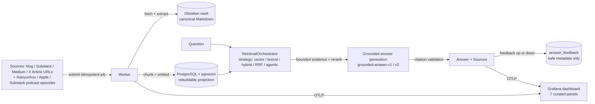

# Knowledge Assistant

A personal knowledge engine that saves long-form content — blog posts, Substack
and Medium essays, X Articles, and podcast episodes — as canonical Markdown in
your own Obsidian vault, then answers questions with grounded, cited answers
from what you saved. Telegram bot and CLI demo included.

## Problem

Generic chat models answer from training data: no memory of the specific
articles you saved, hallucinated details about niche essays, no citations. This
project inverts that — your vault is the source of truth, every answer is
generated from retrieved evidence with validated citations, and if the answer
isn't in your knowledge base, it abstains instead of guessing.

## Demo

Send the bot an article URL — it's saved to your vault and indexed:


Ask questions; answers cite the exact sources:


No Telegram needed to try the full RAG path:

```shell
docker compose up -d --build postgres migrate worker
docker compose --profile tools run --rm admin demo ingest
docker compose --profile tools run --rm admin \
  demo ask --question "What do engineers actually need to get good at?"
```

Real output (`weighted-hybrid-v1`, truncated):

> According to the essay, engineers need to become good at far more than
> programming: they need to navigate the surrounding human and organizational
> work. [E1]
>
> Sources:
> [E1] 21 Lessons from 14 Years at Google — https://addyo.substack.com/p/21-lessons-from-14-years-at-google

## Supported sources

| Source | Provider | Notes |
| --- | --- | --- |
| Any public blog/article page | `web` | static HTML pages from any HTTPS site |
| Substack essays | `substack` | including `.substack.com` publications |
| Medium articles | `medium` | with a bounded RSS fallback for HTTP 403 |
| X Articles | `xquik_mpp` / `xquik` | Article-only; ordinary posts/threads fail clearly |
| Xiaoyuzhou episodes | `podcast` | episode links (`/episode/<id>`), transcribed on ingest |
| Apple Podcasts episodes | `podcast` | episode links carrying `?i=<id>`; show links are rejected |
| Substack podcast posts | `podcast` | Substack URLs whose payload includes an audio file |

Paywalled and JavaScript-only pages fail with explicit errors rather than
ingesting garbage. Podcast transcription costs money per episode (see
[Costs](#costs)); every other source is free.

## Evaluation

All scores are real runs against the committed `sample-docs-v1` dataset
(25 curated questions over 4 public essays) on projection `bd3a3ba7-…`
(`text-embedding-3-small`, 1536 dims). Rerun commands are in
[data/sample/README.md](./data/sample/README.md); full breakdowns in
[data/sample/benchmark-summary.md](./data/sample/benchmark-summary.md) and
[data/sample/answer-benchmark-summary.md](./data/sample/answer-benchmark-summary.md).

Retrieval (2026-08-17; no-answer cases excluded from Hit@K/MRR):

| Strategy | Hit@5 | Hit@20 | MRR | Latency | No-answer FP |
| --- | --- | --- | --- | --- | --- |
| vector-only-v1 | 1.000 | 1.000 | 0.871 | 0.61s | 0.333 |
| lexical-only-v1 | 0.773 | 0.909 | 0.656 | 0.48s | 0.667 |
| **weighted-hybrid-v1 (default)** | **0.909** | **1.000** | **0.814** | **0.47s** | 0.667 |
| rrf-hybrid-v1 | 0.909 | 1.000 | 0.848 | 0.45s | 0.333 |
| agentic-decomposition-v1 | 0.955 | 1.000 | 0.873 | 2.45s | 0.333 |

Per the pre-registered selection policy, no candidate clears all four gates
(exact-lookup slice regression, tie, latency, aggregate quality respectively),
so `weighted-hybrid-v1` stays the default.

End-to-end answers (structured LLM judge; uncalibrated model opinions until
human-labeled calibration is run — currently `not_run`):

| Approach | Citation validity | Coverage | No-answer abstention | Judge overall |
| --- | --- | --- | --- | --- |
| grounded-answer-v1 (baseline) | 96% | 0.36 | 0% | 2.56 |
| grounded-answer-v2 (default) | 100% | **0.48** | **66.7%** | **2.92** |

## Setup

Requirements: Python 3.12+ with [uv](https://docs.astral.sh/uv/), Docker
Desktop, OpenAI API key, and a folder to use as your Obsidian vault.

```shell
git clone https://github.com/Xue-Zhiming-Bruce/knowledge-base-assistant-bot.git
cd knowledge-base-assistant-bot
cp .env.example .env          # fill in OPENAI_API_KEY etc.; see notes below
uv sync --extra dev           # dev only: PYTHONPATH=src uv run pytest
docker compose config --quiet
docker compose up -d --build
```

Configuration lives in `.env`; every variable is documented with comments in
[`.env.example`](./.env.example). Required: the PostgreSQL connection from the
compose stack, `KNOWLEDGE_ASSISTANT_VAULT_PATH`, and `OPENAI_API_KEY`. Optional:

- **Telegram bot**: `KNOWLEDGE_ASSISTANT_TELEGRAM_TOKEN` plus numeric
  `KNOWLEDGE_ASSISTANT_TELEGRAM_ALLOWED_USER_IDS`; runs under the `telegram`
  profile (`docker compose --profile telegram up -d bot`). The bot fails closed
  while the allowlist is empty.
- **Podcasts**: `KNOWLEDGE_ASSISTANT_TRANSCRIPTION_MODEL`, default
  `gpt-transcribe`
- **X Articles**: `KNOWLEDGE_ASSISTANT_X_ARTICLE_PROVIDER` = `xquik_mpp`
  (default, Tempo micropayments) or `xquik` with
  `KNOWLEDGE_ASSISTANT_XQUIK_API_KEY`
- **Grafana monitoring**:
  `KNOWLEDGE_ASSISTANT_OTEL_EXPORTER_OTLP_ENDPOINT=http://lgtm:4318`

Never commit `.env`. Model calls cost cents on small runs; everything else
(`migrate`, `check-config`, `sample-ingest`, `demo ingest`) is free.

### Costs

| Path | Cost |
| --- | --- |
| Embedding + answering | fractions of a cent per question |
| X Articles | ~$0.00075 per Article (Xquik/Tempo) |
| Podcast episodes | $0.0045 per minute of audio (`gpt-transcribe`), so an 80-minute episode is ~$0.36 |

Everything except X Articles and podcasts is free to ingest.

## Testing

```shell
docker compose --profile test run --rm test          # full suite, coverage gate
PYTHONPATH=src uv run pytest                         # local, no Docker
```

The test image bundles ffmpeg and runs the full suite with a 90% coverage gate.
Locally, install ffmpeg or the audio-segmentation tests skip themselves.
Database and retrieval tests skip unless a live Postgres is reachable:

```shell
docker compose --profile test run --rm \
  -e KNOWLEDGE_ASSISTANT_DATABASE_URL="postgresql://knowledge_assistant:<password>@postgres:5432/knowledge_assistant" \
  test
```

> **macOS note:** the local `.venv` editable-install marker can intermittently
> pick up the `UF_HIDDEN` flag, which CPython's `site` module skips, breaking
> plain `uv run pytest`. Use `PYTHONPATH=src uv run pytest`.

There is no CI. Tests are run locally or in the Docker test image.

## How it works



**Ingestion**: the worker fetches the article, extracts canonical Markdown into
the vault (with content-addressed image assets), then chunks, embeds, and
writes projection rows scoped to a generation. The vault Markdown is the source
of truth — every database row can be rebuilt with `projection-rebuild` +
atomic `projection-activate`.

**Podcasts** branch off before extraction, because a podcast has no article to
fetch: the page is resolved to an audio URL, the audio is downloaded and split,
and speech-to-text produces the Markdown instead. The episode title is sent as a
transcription prompt so names survive (otherwise `BitMEX` comes back as `BTX`),
and the model's detected language is recorded on the document. Everything after
the transcript joins the pipeline above unchanged.

**Answering**: the question retrieves candidate chunks from the active
projection (semantic, lexical, weighted hybrid, RRF, or bounded agentic
decomposition), a diversity reranker bounds the context, and a structured
generator produces a cited answer. A deterministic validator rejects answers
whose citations don't resolve to the retrieved evidence.

**Monitoring**: `/feedback up`/`down` stores only safe metadata (never
questions, answers, or URLs) and feeds a Grafana dashboard provisioned
automatically from `config/grafana/`.

## Project structure

```text
src/knowledge_assistant/
├── domain/          entities and invariants: documents, chunks, sources, podcasts, retrieval
├── ports/           interfaces the application owns: vault, embeddings, transcription, answers
├── application/     use cases: worker, bot, podcasts, questions, retrieval, projections, deletion
├── infrastructure/  adapters: postgres, openai, vault, http fetchers, telegram, telemetry
└── cli.py           entrypoint behind every command in compose.yaml
config/grafana/      provisioned dashboard (7 panels)
data/sample/         committed evaluation dataset and result summaries
docs/operations/     runbooks, e.g. rotating the Tempo key
scripts/             one-off maintenance scripts
tests/               pytest suite
```

The vault the application writes is separate from this repository and is not
committed. Articles land under `Articles/<provider>/<topic>/` and podcasts under
`Podcasts/<platform>/<topic>/`.

## Limitations

- The benchmark is a 25-case sample over 4 documents; scores are indicative,
  not significant. The judge scores are uncalibrated model opinions.
- JavaScript-only pages can't be extracted and fail explicitly.
- X Articles require the paid Xquik/Tempo path; podcasts require paid
  transcription. Other sources are free.
- Podcast segmentation cuts on detected pauses; shows with music under the
  voice or no real quiet between speakers fall back to fixed 10-minute cuts,
  which can split a word at the boundary.
- A mistranscribed podcast transcript is written to the vault as fact. Unlike a
  failed fetch, it reports success — nothing flags an error after the fact.
- There is no CI and no public deployment; the system runs locally via Docker
  Compose.
- Article bodies stay in your vault and are never committed; copyright belongs
  to the authors.
