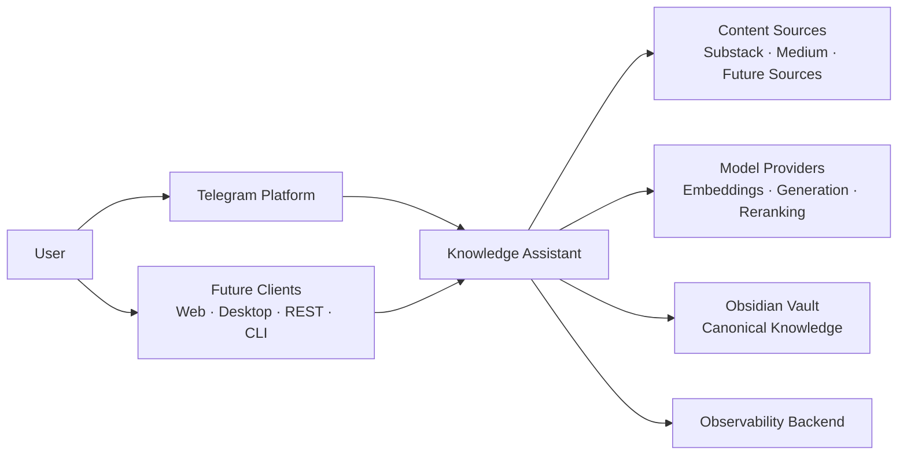
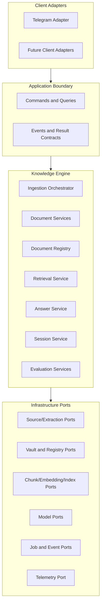

# System Context and Boundaries

## Why this document exists

This document defines what is inside Knowledge Assistant, what remains external, and how responsibilities are divided. It prevents client concerns, provider details, and persistence mechanics from leaking into the core product.

## System context

External systems are untrusted with respect to availability, latency, response shape, and rate limits. Source content is also untrusted input and must not be allowed to act as system instructions.

## Logical architecture

Dependencies point inward. Client and infrastructure adapters may depend on application and domain contracts; domain code must not import Telegram, a vector database, a model SDK, or an observability vendor.

## Architectural layers

### Client adapters

Responsibilities:

- authenticate or identify the caller;
- translate client-specific interactions into application commands;
- acknowledge accepted work quickly;
- render status, answers, citations, and errors in client-native form;
- subscribe to or receive completion events.

Client adapters do not decide ingestion eligibility beyond basic syntactic checks, run extraction, manage prompts, or access vector storage directly.

### Application boundary

The stable entry point for every client. It exposes use-case-oriented operations such as:

- submit a document source;
- inspect ingestion status;
- start, continue, and end a question session;
- ask a question;
- rebuild derived artifacts;
- inspect document metadata.

It coordinates authorization, validation, idempotency, and transaction boundaries, then delegates policy to domain services.

### Knowledge Engine

The engine owns:

- source acceptance policy;
- document identity and lifecycle;
- extraction and normalization policy;
- metadata and provenance rules;
- registry consistency;
- chunking and indexing policy;
- retrieval, reranking, and context assembly;
- grounded answer and citation policy;
- temporary session lifecycle;
- evaluation definitions and hooks.

### Infrastructure adapters

Adapters implement replaceable capabilities for:

- source fetching and extraction;
- filesystem/vault access;
- registry persistence;
- queues, schedulers, and event delivery;
- embedding, reranking, and language models;
- vector and lexical indexes;
- telemetry export and secret retrieval.

Adapters may contain provider-specific optimizations but must preserve engine semantics.

## Runtime components

The logical modules may initially run in a small number of deployables:

1. **Client/API process** — receives Telegram updates and future API requests, validates envelopes, and submits durable commands.
2. **Worker process** — executes ingestion, index maintenance, and other background jobs.
3. **Query process** — serves interactive retrieval and answer requests; it may initially share a deployment with the API.
4. **Persistence systems** — vault storage plus PostgreSQL for registry/job state and initial derived retrieval indexes.
5. **Telemetry pipeline** — receives logs, traces, metrics, and cost events.

These are deployment boundaries, not permission to couple modules. The initial architecture favors a modular monolith with separate worker execution over distributed microservices. Modules can be extracted later when scaling, isolation, or ownership justifies it.

## Trust boundaries

| Boundary | Main risks | Required controls |
| --- | --- | --- |
| Client to application | forged identity, duplicate updates, abuse | authentication, authorization, idempotency keys, rate limits |
| Application to source | SSRF, malicious markup, oversized content | URL policy, network egress controls, size/time limits, sanitization |
| Engine to model provider | privacy leakage, prompt injection, availability | data minimization, provider policy, prompt boundaries, timeouts |
| Engine to vault | path traversal, partial writes, conflicting edits | path policy, atomic writes, optimistic concurrency, backups |
| Engine to derived stores | stale or incompatible projections | content/version fingerprints, reconciliation, rebuild tooling |
| Telemetry export | accidental sensitive data disclosure | redaction, allowlisted fields, access controls, retention policy |

## Interaction patterns

- **Synchronous command acceptance:** validates a request and persists intent before acknowledging it.
- **Asynchronous workflow execution:** durable workers advance ingestion through explicit states.
- **Synchronous interactive query:** retrieval and answer generation run under bounded latency budgets.
- **Domain events:** announce durable facts such as `DocumentIngestionCompleted`; consumers must be idempotent.
- **Administrative reconciliation:** scans canonical and registry state to detect drift and rebuild projections.

Events do not replace the canonical vault or registry. They coordinate reactions to facts that are already durable.

## Important trade-offs

### Modular monolith before microservices

This reduces operational complexity and enables stronger local transactions while preserving internal seams. The cost is that resource isolation and independent scaling are coarser initially. Separate worker processes provide the first useful isolation boundary.

### Files plus registry database

The vault preserves portability; PostgreSQL supplies registry state, uniqueness, leases, operational queries, and the initial RAG projections. This creates a consistency problem, addressed through explicit write protocols and reconciliation rather than pretending a filesystem and database form one atomic transaction.

PostgreSQL is an infrastructure decision, not a domain dependency. Core services continue to use registry, vector-index, lexical-index, session, job, and outbox ports. This preserves the ability to move an index or workload later without changing Knowledge Engine policy.

### Stable application contracts

Use-case contracts add design effort but prevent Telegram behavior from becoming the de facto API. Future clients should reuse the same commands and result models without importing Telegram concepts.
