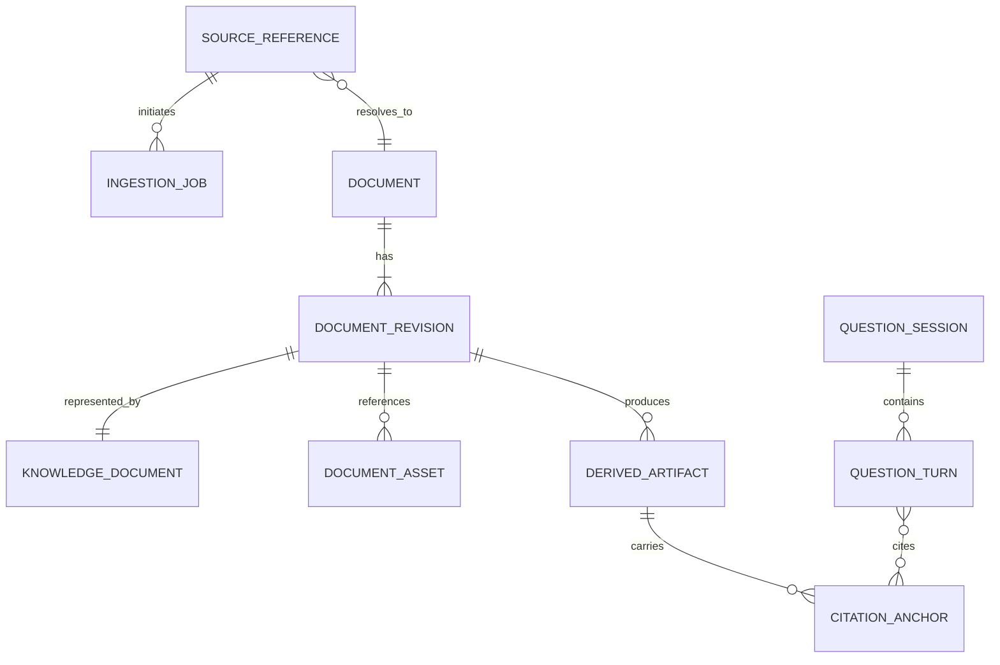

# Domain Model and Knowledge Document

## Why this document exists

This document defines the shared language and canonical data contract of Knowledge Assistant. Stable identity, provenance, and lifecycle semantics are prerequisites for reliable ingestion, rebuildable indexes, citations, and future source types.

## Core domain concepts

### Source Reference

A user-submitted locator for external content. This may currently be a Substack
or Medium article URL or an X status URL identifying a rich X Article. Future
references may be a PDF, audio object, or video URL. A
Source Reference is input, not yet trusted knowledge.

### Source Snapshot

An immutable record of the bytes or structured content observed during extraction, with acquisition time, final URL, content fingerprint, and extractor provenance. Retaining raw snapshots is policy-controlled; when they are not retained, their fingerprint and acquisition metadata still are.

### Document

The source-neutral conceptual work: an article, paper, transcript, or other long-form item. It owns durable identity and provenance and is not tied to a file format or source provider.

### Knowledge Document

The canonical representation of a Document in the vault: normalized Markdown
content, validated YAML frontmatter, and any locally referenced canonical
assets. This bundle is the authoritative knowledge artifact.

### Document Asset

An immutable binary, initially an article image, referenced from canonical
Markdown. Assets are addressed by their content hash and carry source URL,
media type, dimensions, byte size, alt text, and fingerprint metadata. OCR,
captions, and visual embeddings are derived artifacts; they never replace the
original asset.

### Document Revision

A specific normalized version of a Knowledge Document. Revisions support source updates, normalization changes, user edits, and reproducible indexes.

### Derived Artifact

Any reproducible projection of a Knowledge Document revision: chunks, embeddings, vector entries, lexical index records, summaries used only for retrieval, or metadata caches.

### Citation Anchor

A stable reference from retrieved evidence to a canonical document and a resolvable content region. It is created during chunking and preserved through answer generation.

### Ingestion Job

A durable attempt to transform a Source Reference into a Knowledge Document and its derived artifacts. Jobs have explicit state, attempt history, and error classification.

### Question Session

Short-lived conversational context for follow-up questions. It references durable documents but is not written into the vault and is deleted at session end or expiry.

## Relationships



## Identity and deduplication

Identity must distinguish three concerns:

- **Document ID:** opaque, stable identifier for the conceptual document. It must not depend on title or file path.
- **Source key:** normalized source identity used to detect duplicate submissions. For URLs this uses a versioned canonicalization policy and known publisher identifiers where available.
- **Revision ID:** identifies an exact canonical content revision, derived from the document identity, normalized content fingerprint, and schema/normalizer version.

URLs can redirect, titles can change, and the same work can appear under multiple URLs. The registry may associate multiple Source References with one Document. Ambiguous merges must be reviewable and reversible.

Duplicate submission of an unchanged source should return the existing document or schedule a freshness check according to policy. Changed source content creates a new revision rather than silently replacing provenance.

## Canonical Knowledge Document contract

### File representation

Each document is a UTF-8 Markdown file inside a controlled vault namespace. The file contains:

1. YAML frontmatter conforming to the current schema version.
2. One top-level title.
3. Normalized body content using portable Markdown.
4. Relative links to locally stored assets where media is part of the source.
5. Optional source notes that preserve meaningful non-body context.

The body favors semantic structure over visual fidelity. Headings, paragraphs, lists, block quotes, code blocks, links, images by reference, and tables should be preserved when meaningful. Navigation, subscription prompts, cookie text, unrelated recommendations, and layout-only elements should be removed.

### Required frontmatter

| Field | Meaning |
| --- | --- |
| `schema_version` | Version of the Knowledge Document contract |
| `document_id` | Stable opaque document identifier |
| `revision_id` | Exact canonical revision identifier |
| `title` | Normalized human-readable title |
| `source_type` | Generic source kind such as `article`, `social_post`, `pdf`, `podcast`, or `video_transcript` |
| `source_provider` | Origin provider such as `substack`, `medium`, or `x` |
| `source_url` | Preferred provenance URL, when applicable |
| `source_urls` | Known equivalent or historical source references |
| `authors` | Ordered list of author display names |
| `published_at` | Source publication time when known |
| `acquired_at` | Time this source revision was fetched |
| `content_fingerprint` | Hash of normalized canonical content |
| `language` | Detected or declared language |
| `ingestion` | Extractor and normalizer version metadata |
| `assets` | Ordered canonical metadata for locally stored image assets |

### Recommended frontmatter

| Field | Meaning |
| --- | --- |
| `updated_at` | Source update time when available |
| `description` | Source-provided or deterministic summary, with provenance |
| `tags` | User or system tags with origin distinguishable |
| `reading_time_minutes` | Derived estimate |
| `word_count` | Deterministic normalized word count |
| `license` | Known source license |
| `content_warnings` | Optional user-facing safety notes |

Unknown metadata is represented as absent, not invented. Model-generated metadata must be explicitly labeled with its generator and version so it is never confused with source claims.

### Conceptual example

```yaml
---
schema_version: 2
document_id: doc_opaque_id
revision_id: rev_opaque_id
title: "An Example Article"
source_type: article
source_provider: medium
source_url: "https://example.com/article"
source_urls:
  - "https://example.com/article"
authors:
  - "Example Author"
published_at: "2026-01-15T10:00:00Z"
acquired_at: "2026-07-28T08:00:00Z"
content_fingerprint: "sha256:..."
language: en
ingestion:
  extractor: "medium-adapter"
  extractor_version: "..."
  normalizer_version: "..."
assets:
  - original_url: "https://cdn.example.com/diagram.png"
    vault_path: "Assets/doc_opaque_id/sha256hex.png"
    content_type: "image/png"
    content_fingerprint: "sha256:..."
    byte_size: 12345
    width: 1200
    height: 800
    alt_text: "System diagram"
---
```

The example fixes field semantics, not serialization-library or identifier-format choices.

## Vault layout and naming

File paths are a human navigation aid, not identity. A configurable path policy may group by source, author, or date, but paths must:

- remain inside the vault namespace;
- be sanitized for portability;
- avoid collisions;
- be recorded by the registry;
- permit safe rename without changing `document_id`.

A title change may suggest a file rename, but automatic renames must respect user modifications and Obsidian link behavior.

Canonical assets use `Assets/<document_id>/<sha256>.<extension>`. Knowledge
Documents reference them with vault-aware Obsidian embeds,
`![[Assets/...]]`. These resolve consistently from notes at any folder depth,
and the references remain stable when the whole vault is moved or synchronized.
Content addressing makes retries idempotent and deduplicates repeated images
within a document without using a source URL as filesystem identity. Future
non-Obsidian clients must interpret this explicitly documented Markdown
extension through their renderer adapter.

## User edits and source refreshes

The vault is both machine-produced and user-accessible. That creates intentional tension.

The architecture follows these rules:

- The engine fingerprints the last canonical revision it wrote.
- Before refresh, it detects whether the current file has diverged.
- Unchanged files may be updated atomically.
- Diverged files are never silently overwritten.
- A conflict produces a proposed revision, sidecar, or review state according to configured policy.
- Derived artifacts index the active accepted revision only.

Future designs may separate machine-managed source content from user annotations, but must preserve a single useful Markdown artifact.

## Schema evolution

Frontmatter is versioned. Readers support the current version and an explicitly defined backward-compatibility window. Migrations:

- are deterministic and idempotent;
- preserve document and revision lineage;
- are previewable and auditable;
- do not require derived stores to remain available;
- trigger projection rebuilds when semantics change.

## Trade-offs

### Markdown as authority

Markdown plus its referenced canonical assets provides portability,
inspectability, and Obsidian compatibility. It is weaker than a transactional
database for constraints and queries, so a registry projection supplies those
capabilities without becoming authoritative for knowledge content.

### Stable anchors in mutable text

Line numbers are understandable but shift after edits; opaque chunk IDs are stable only for a particular revision. Citations therefore combine revision identity with structural and textual evidence, enabling exact resolution when unchanged and graceful matching after benign edits.

## Extension points

- new `source_type` and `source_provider` values;
- additional metadata namespaces with explicit ownership;
- media attachments and transcript timecodes;
- document relationships such as series, replies, or editions;
- user annotations and semantic links;
- alternate vault layout policies;
- richer citation anchors for pages, timestamps, figures, and table cells.
