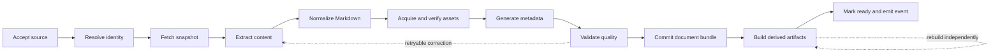
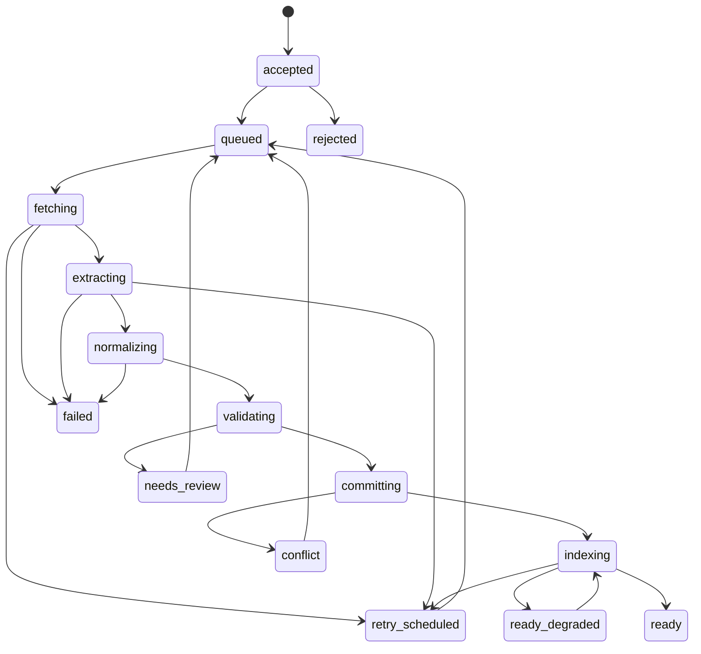

# Ingestion Architecture

## Why this document exists

Ingestion converts untrusted, unstable external content into durable knowledge. This document defines the workflow, boundaries, state model, and recovery rules that make ingestion asynchronous, observable, idempotent, and extensible.

## Responsibilities

The ingestion subsystem owns:

- validating and classifying submitted source references;
- deduplicating requests and resolving document identity;
- fetching content under network safety policies;
- extracting source structure and metadata;
- normalizing content into the Knowledge Document contract;
- validating quality and provenance;
- committing canonical files and registry state;
- creating or refreshing derived artifacts;
- emitting lifecycle events and user-notification outcomes.

It does not own Telegram messages, answer generation, or provider-specific rendering.

## Pipeline

Each stage receives a versioned input contract and returns a typed result. Stages do not communicate through hidden global state. Intermediate outputs needed for retry or diagnosis are persisted according to retention and privacy policy.

## Implemented first vertical slice

The production slice implements the pipeline for public Medium and Substack
articles plus rich X Articles acquired directly from Xquik:

- a normalized source classifier and deterministic document identity;
- a bounded HTTP fetcher with DNS/IP, redirect, content-type, and size checks;
- a Medium-specific acquisition fallback that selects the requested article
  from the provider's public RSS feed when direct HTML is denied with HTTP 403;
- an Xquik adapter for lossless ordered Article blocks, author metadata, and media;
- support for HTTPS Substack custom-domain redirects only when the resulting
  HTML contains platform identity markers;
- source-neutral article extraction to Markdown;
- ordered article-image discovery with stable extraction placeholders;
- public-HTTPS image acquisition with DNS/IP and redirect revalidation, byte
  and pixel limits, decoded-format validation, and content hashing;
- content-addressed vault assets with stable, vault-aware Obsidian embeds;
- durable PostgreSQL jobs claimed with `FOR UPDATE SKIP LOCKED`;
- explicit state transitions from `fetching` through `ready`;
- deterministic Markdown chunking and OpenAI embedding generation;
- pgvector and full-text projection writes;
- atomic, conflict-aware vault commits;
- transactional creation of completion notifications and retryable Telegram
  delivery.

The job database is operational coordination and the initial RAG projection
store. Markdown and its referenced vault assets remain canonical: jobs, chunks,
embeddings, and projection generations can be recreated from Knowledge
Documents.

## Source adapters

A source adapter answers source-specific questions:

- Does this adapter recognize the reference?
- How is the canonical source identity derived?
- How is content fetched within legal and operational constraints?
- How are title, authorship, publication time, and main content extracted?
- Which source-specific warnings should be surfaced?

The adapter returns a source-neutral extraction result. It must not write vault files, generate embeddings, or construct user notifications.

The first slice shares a hardened generic article extractor behind provider
classification. Provider-specific extractors can replace it independently when
markup drift or extraction evaluation demonstrates a need. Source adapters never
write vault files, generate embeddings, or construct notifications.

Acquisition policy is provider-aware but remains behind the source-fetcher
port. Medium HTML is attempted first. If Medium returns HTTP 403, the Medium
adapter derives the publication or author feed, fetches it under the same SSRF,
redirect, content-type, byte, and timeout controls, and matches exactly the
requested article by stable story identity or normalized path. The feed is not
treated as a batch-ingestion request. If the requested story is absent—such as
an older story outside the feed window—the job fails explicitly rather than
silently ingesting another entry. This fallback avoids executing challenge
JavaScript or depending on a third-party content proxy.

X status URLs normalize to the provider's stable post ID regardless of `x.com`
or legacy `twitter.com` host aliases. X acquisition sends that ID directly to
Xquik's Article endpoint through either a worker-only API key or a scoped Tempo
MPP wallet. Only complete rich Articles are accepted. Ordinary posts, long
posts, threads, unknown blocks, and lossy representations fail explicitly. The
adapter preserves Xquik's block order and never uses X API credentials, browser
cookies, private endpoints, or reconstructed plain text.

## Normalization

Normalization is deterministic where possible. It:

- converts extracted structure to portable Markdown;
- removes known boilerplate;
- normalizes whitespace, headings, links, and media references;
- preserves meaningful ordering and quotations;
- calculates a canonical content fingerprint;
- records normalizer version and warnings.

Provider presentation components are reduced to semantic Markdown. For example,
a Substack article-card embed becomes one title link rather than nested author,
date, and call-to-action links, and known redirect wrappers are resolved to
their validated public destination. Redundant square brackets around standard
links are removed so they cannot be misinterpreted as Obsidian wikilinks. This
preserves knowledge and provenance without carrying fragile website UI
structure into Obsidian.

Model-assisted cleanup may be offered behind a policy-controlled stage, but raw extraction and deterministic normalization must remain inspectable. Model transformations must not invent missing content, and their provider/model/prompt versions become provenance.

## Image acquisition and normalization

Extractors identify images while they still have source ordering and placement,
then emit opaque placeholders rather than downloading content themselves. The
asset materializer resolves those placeholders after document identity and
target path are known.

For every accepted image, the materializer:

1. fetches only public HTTPS targets and revalidates every redirect;
2. enforces redirect, response-byte, and decoded-pixel limits;
3. verifies actual JPEG, PNG, WebP, or GIF bytes rather than trusting headers or
   filename extensions;
4. hashes the bytes and deduplicates equal content within the document;
5. assigns `Assets/<document_id>/<sha256>.<extension>`;
6. replaces the placeholder with a vault-aware `![[Assets/...]]` Obsidian
   embed, removing source-site clickable wrappers that render inconsistently
   across Markdown clients, and records canonical asset metadata.

Image acquisition is capped per document. A permanently missing, invalid, or
unsupported image becomes an explicit omission marker and does not discard the
article. A timeout, network error, rate limit, or upstream server failure is
retryable so a temporary CDN problem does not silently create a degraded
canonical revision.

## Metadata generation

Metadata has explicit origin:

- **source metadata** — directly observed from the source;
- **derived deterministic metadata** — language, word count, fingerprint;
- **model-generated metadata** — optional tags or summaries;
- **user metadata** — annotations or corrections.

Precedence and conflict rules are defined per field. Model-generated values never overwrite reliable source or user values silently.

## Processing states

State names describe durable facts, not worker activity alone.

- `ready` means canonical knowledge and required projections are available.
- `ready_degraded` means the Knowledge Document is durable but one or more non-critical derived artifacts are unavailable.
- `rejected` means the source is unsupported or violates policy and should not be retried unchanged.
- `failed` means automatic recovery is exhausted.
- `needs_review` covers questionable extraction quality.
- `conflict` protects divergent user-edited content.

## Idempotency and concurrency

Submission uses a client update ID or generated idempotency key plus normalized source key. Processing uses:

- unique job identity;
- compare-and-set state transitions;
- bounded leases with heartbeats;
- stage output fingerprints;
- atomic file replacement;
- uniqueness constraints on document/source associations;
- idempotent event consumers.

At-least-once job delivery is assumed. Exactly-once processing is not.

Concurrent submissions of the same source converge on one active source-resolution workflow. Requests may attach multiple notification recipients to the same job without duplicating document writes.

## Commit protocol

The filesystem and registry cannot participate in one portable transaction. The workflow therefore uses a recoverable protocol:

1. Validate the complete Knowledge Document in a staging location.
2. Persist a registry intent containing target path, revision, and fingerprint.
3. Atomically write missing immutable, content-addressed assets.
4. Atomically move or replace the Markdown file, which acts as the bundle commit
   marker.
5. Mark the registry revision committed.
6. Emit an outbox event for projection building.

A crash before the Markdown commit can leave only harmless unreferenced,
content-addressed assets. A reconciler detects interrupted intents, orphaned
assets or files, missing referenced assets, and registry/file fingerprint
mismatches. Recovery actions are deterministic and audited.

## Retry and failure policy

Errors are classified:

- **transient:** timeouts, rate limits, temporary provider failures;
- **permanent input:** unsupported source, inaccessible private content, invalid URL;
- **policy:** blocked host, size limit, disallowed redirect;
- **quality:** extraction too short, missing core fields, suspicious boilerplate ratio;
- **conflict:** user-edited target or identity ambiguity;
- **internal:** violated invariant or unexpected adapter failure.

Transient errors use exponential backoff with jitter, attempt caps, and provider-specific rate budgets. Permanent and policy errors are not blindly retried. Exhausted or unknown failures enter a dead-letter workflow with enough context to diagnose and replay safely.

## Notifications

The engine emits lifecycle facts such as:

- `IngestionAccepted`;
- `IngestionProgressed` for operator use;
- `DocumentIngestionCompleted`;
- `DocumentIngestionFailed`;
- `DocumentNeedsReview`.

Client adapters decide how to render these facts. Notification delivery is independently retryable; a failed Telegram message must not change document state.

For the current slice, marking a job `ready`, writing its outbox event, and
creating Telegram delivery records occur in one PostgreSQL transaction. The
worker dispatches pending deliveries independently with exponential backoff.
This preserves completion notifications across process restarts without making
Telegram availability part of document durability.

## Quality gates

Before commit, validation checks:

- schema and required metadata;
- non-empty, plausible main content;
- title and provenance presence;
- duplicate or boilerplate ratios;
- Markdown structural validity;
- link and encoding sanity;
- content-size boundaries;
- extractor warnings and confidence.

Thresholds are calibrated with the ingestion evaluation dataset, not chosen solely by intuition.

## Future extension points

- binary-object acquisition for PDFs and audio;
- OCR, image captioning, and layout-aware extraction as rebuildable projections;
- transcription with speaker and timestamp provenance;
- human review queues;
- scheduled source refresh;
- batch imports;
- authenticated source connectors;
- cross-document asset deduplication and retention-aware garbage collection;
- content safety and malware scanning.
