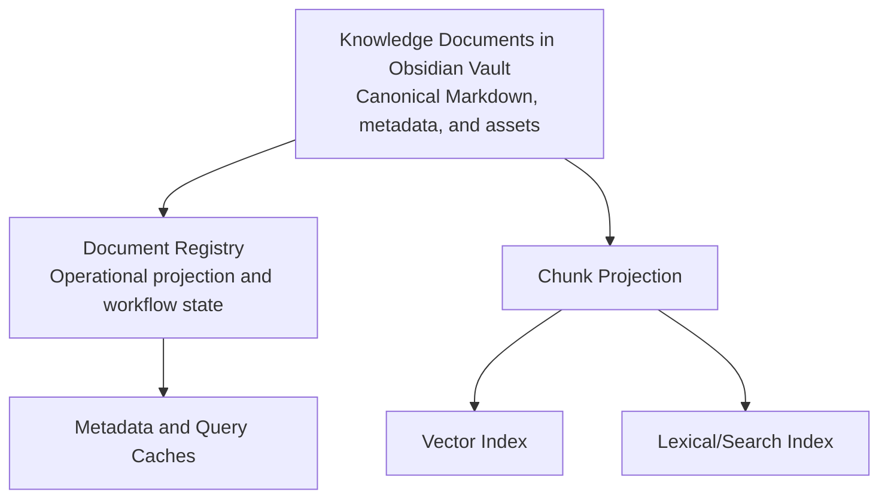

# Storage, Registry, and Derived Data

## Why this document exists

Knowledge Assistant deliberately combines human-readable canonical files with operational and retrieval stores. This document defines authority, consistency, rebuildability, and ownership so that convenience stores never become accidental sources of truth.

## Data authority



The arrow means “can be rebuilt from,” not necessarily direct runtime flow.

## Initial PostgreSQL role

The initial production architecture uses PostgreSQL as the shared transactional and retrieval platform. It stores:

- document registry and revision projections;
- ingestion jobs, leases, attempt history, and outbox events;
- notification delivery state;
- temporary question sessions with explicit expiry;
- chunk text and citation metadata derived from canonical revisions;
- vector embeddings through a PostgreSQL vector extension such as pgvector;
- lexical search projections using PostgreSQL full-text search;
- projection manifests, active-generation pointers, and reconciliation findings.

This consolidation reduces the number of stateful systems required for the initial production deployment and allows hybrid RAG retrieval to use transactional metadata filters.

PostgreSQL is **not** authoritative for Knowledge Document content. Chunk text, embeddings, search vectors, and copied metadata in PostgreSQL are rebuildable projections. Operational records such as job and delivery state are authoritative for their workflows but are not canonical knowledge.

### Canonical

- Knowledge Document Markdown body;
- YAML frontmatter;
- locally referenced canonical source assets and their fingerprints;
- accepted document revisions and provenance encoded in or associated with the vault according to retention policy.

### Operationally durable but not canonical knowledge

- ingestion job state;
- outbox events;
- notification delivery state;
- session expiration state;
- projection checkpoints;
- audit records.

These records may not be reconstructable from Markdown alone, but losing them must not destroy the user's knowledge archive.

### Rebuildable

- parsed document caches;
- chunks and chunk metadata;
- embeddings;
- vector and lexical index entries;
- retrieval caches;
- generated search facets;
- index compatibility manifests.

## Vault port

The vault interface provides domain-oriented operations:

- read a Knowledge Document and fingerprint;
- stage and validate a revision;
- atomically commit a revision;
- commit immutable assets before the Markdown bundle marker;
- enumerate managed documents;
- detect external changes;
- resolve a citation anchor to canonical content;
- quarantine or report malformed files.

It does not expose unrestricted filesystem paths to domain services. Path construction, sanitization, atomicity, and filesystem-specific behavior remain inside the adapter.

## Document registry

The registry is the operational catalog. It tracks:

- document, source, and revision identities;
- current accepted revision and vault path;
- canonical asset paths, source URLs, media metadata, and fingerprints;
- content and schema fingerprints;
- ingestion jobs and state transitions;
- extractor, normalizer, chunker, embedding, and index versions;
- projection readiness and error status;
- document tombstones and merge aliases;
- optimistic concurrency data;
- audit and reconciliation findings.

The registry accelerates lookups and coordinates work. If registry content conflicts with a valid canonical document, the system enters reconciliation rather than silently choosing whichever value was read last.

## Chunk projection

Chunking converts a canonical revision into retrieval units while preserving document structure.

Each chunk contains:

- stable chunk identity scoped to revision and chunker version;
- document and revision IDs;
- ordered content;
- heading ancestry or structural path;
- character or token offsets where meaningful;
- citation anchor data;
- content fingerprint;
- language and retrieval metadata;
- chunker version.

Chunk boundaries should prefer semantic sections and paragraphs, with controlled overlap only when it improves context continuity. A chunk is evidence, not an independent canonical document.

## Embedding and index compatibility

Every derived entry records a compatibility tuple:

```text
canonical schema
normalizer version
chunker version
embedding provider/model/dimensions
index schema
retrieval feature version
```

A changed tuple creates a new projection generation. Mixed incompatible generations are never queried as though they were homogeneous.

Reindexing should support build-then-switch:

1. Build a new generation alongside the active one.
2. Validate completeness and evaluation thresholds.
3. Atomically switch the active generation.
4. Retain the previous generation for bounded rollback.
5. Remove obsolete derived data after the rollback window.

The active generation must remain queryable while an incompatible candidate is being
built. Single-document ingestion must never retire the active generation merely
because its configured compatibility manifest has changed. A candidate becomes active
only after a full-corpus build, completeness validation, and required retrieval
evaluation, using an atomic active-generation switch.

The current implementation gap and its required state transitions and acceptance
criteria are tracked in
[Monitoring, Projection Cutover, and Synthetic Evaluation Plan](./14-monitoring-and-evaluation-implementation-plan.md).

## Retrieval stores

The architecture supports hybrid retrieval:

- a vector index for semantic similarity;
- a lexical index for exact terminology, names, and phrases;
- registry filters for document, source, language, time, or tags.

The initial adapter implements these capabilities in PostgreSQL using a vector extension such as pgvector, PostgreSQL full-text search, and normal relational indexes. Vector and lexical candidates are combined and reranked through the engine-owned retrieval policy.

PostgreSQL is a strong initial choice for a personal knowledge corpus because it provides transactions, metadata filtering, mature operations, and hybrid retrieval without a separate vector-database dependency. If corpus size, query volume, index features, or operational isolation later justify a specialized search system, the same ports and projection-generation model permit migration. The engine depends on retrieval semantics, not PostgreSQL query syntax.

## Cache policy

Caches must declare:

- cache key and included version identifiers;
- authoritative source;
- maximum staleness;
- invalidation trigger;
- privacy classification;
- safe behavior on miss or corruption.

Correctness cannot depend on best-effort invalidation alone. Versioned keys make stale data unreachable after semantic changes.

## Reconciliation

A scheduled and on-demand reconciler compares:

- registry documents against vault files;
- stored fingerprints against current files;
- frontmatter asset manifests against referenced and stored asset files;
- active revisions against projection manifests;
- projection counts and checksums against chunk outputs;
- tombstones against residual index entries.

It reports drift before repair. Safe repairs may be automated; destructive or ambiguous repairs require review.

## Backup and restore

The vault, including its `Assets/` tree, receives the strongest backup and
restore guarantees. Registry and job state are backed up to reduce recovery
time, but the recovery plan assumes derived stores can be lost completely.

A restore drill must prove:

1. Knowledge Documents can be restored independently.
2. The registry can be reconstructed or reconciled.
3. All retrieval artifacts can be rebuilt.
4. Citations resolve to the same document revisions.
5. The restored corpus passes a representative retrieval evaluation.

## Deletion

Deletion is an explicit lifecycle operation:

- mark intent and stop new retrieval;
- remove or tombstone the canonical document according to user policy;
- remove derived artifacts and caches;
- preserve only required audit facts with minimized metadata;
- verify completion across projections;
- make retries idempotent.

Source unavailability is not deletion. A refresh failure never deletes existing canonical knowledge.

## Trade-offs

### Registry duplication

Duplicating frontmatter fields enables efficient operations but creates drift risk. Fingerprints, versioning, and reconciliation make the duplication explicit and manageable.

### Hybrid retrieval

Maintaining lexical and vector projections adds operational cost but protects exact-match recall and improves debuggability. Co-locating both in PostgreSQL initially reduces infrastructure overhead, although a specialized engine may eventually provide better approximate-nearest-neighbor performance or search features.

## Future extension points

- remote or synchronized vaults;
- encrypted-at-rest object storage for source snapshots;
- multiple vault namespaces;
- document-level access controls;
- graph indexes and explicit document relationships;
- incremental embedding updates;
- alternate lexical or vector engines;
- user-controlled archival and retention tiers.
