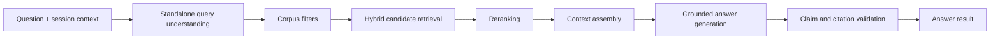
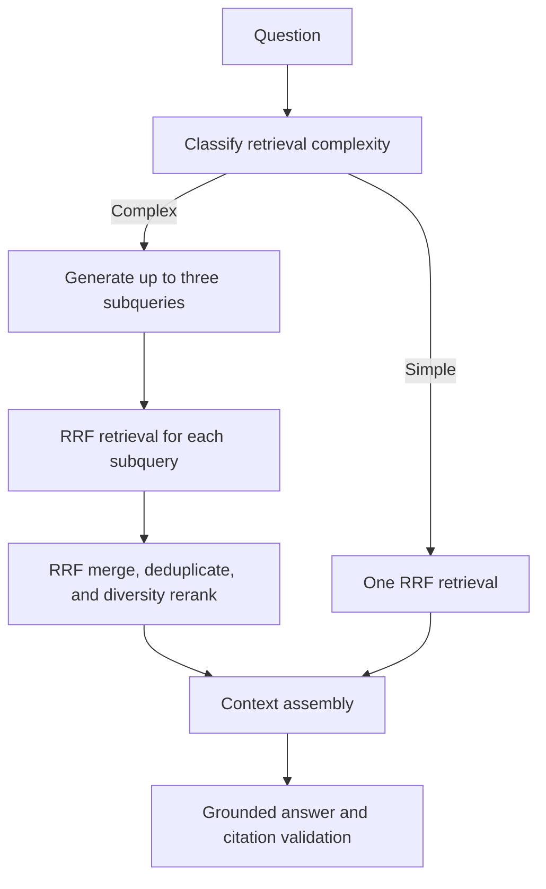

# Retrieval, Answers, and Citations

## Why this document exists

Answer quality depends on more than a language model. This document defines the evidence pipeline, grounded-generation contract, and citation guarantees so retrieval and generation can evolve independently without obscuring provenance.

## Responsibilities

The query subsystem owns:

- interpreting a question in session context;
- applying authorization and corpus filters;
- retrieving broad candidate evidence;
- reranking candidates;
- assembling a bounded, diverse context;
- generating answers constrained to evidence;
- attaching and validating citations;
- recording versioned telemetry and evaluation data.

It does not modify canonical documents during a question session.

## Query pipeline



Every stage exposes a replaceable contract and emits traceable intermediate identifiers. Evaluation can run stages separately or end to end.

## Implemented first query slice

Question Mode now implements:

- query embedding with the configured embedding provider;
- hybrid PostgreSQL retrieval using pgvector cosine similarity and full-text
  ranking over the active compatible projection generation;
- deterministic score-and-document-diversity reranking;
- bounded context assembly with stable evidence identifiers;
- OpenAI Responses API generation with structured output and provider-side
  response storage disabled;
- deterministic validation that every emitted evidence marker resolves to a
  retrieved chunk;
- Telegram rendering with source title and canonical URL.

The initial deterministic reranker is intentionally replaceable. The optional
reranking-model setting is not required by this version and can later back a
cross-encoder or model-based implementation after evaluation demonstrates value.

### Current production default

The default retrieval method is **single-pass weighted hybrid RAG**. It embeds the
original normalized question once and evaluates every eligible chunk in the active
compatible projection with two PostgreSQL signals:

- semantic similarity: `max(0, 1 - cosine_distance)` from pgvector;
- lexical relevance: `ts_rank_cd` over `websearch_to_tsquery('simple', question)`.

The current combined score is:

```text
0.75 * semantic_score + 0.25 * lexical_score
```

The query retrieves up to 20 candidates. A deterministic reranker orders by combined
score and limits domination by one document, selecting up to eight chunks and no more
than three chunks per document. Context assembly then permits at most 2,400 characters
from one chunk and 16,000 characters overall.

This baseline is hybrid because it combines vector and lexical retrieval. It is not
agentic: there is one retrieval call using the original question, no query rewriting
or decomposition, and no evidence-driven retrieval retry. Session history is supplied
to answer generation but does not currently alter the retrieval query.

The vector and lexical scores are not calibrated to a common distribution. The
numeric weights therefore describe the formula but must not be interpreted as a
measured 75/25 contribution to ranking quality.

## Query understanding

Follow-up questions may rely on recent session turns. Query understanding produces:

- a retrieval-ready standalone query;
- optional subqueries;
- explicit filters inferred only when confidence is sufficient;
- ambiguity indicators;
- the original user wording for answer generation.

Rewriting must not silently narrow intent or add facts. Both original and rewritten queries are retained in temporary trace context, subject to privacy policy.

## Candidate retrieval

The retrieval service combines complementary signals:

- semantic vector similarity;
- lexical or phrase matching;
- metadata filters;
- recency only when the question calls for it;
- document and source diversity;
- optional prior-session evidence continuity.

Candidate retrieval favors recall. It returns evidence references and scores, not rendered citations or answers.

## Candidate RAG strategies

Retrieval methods are versioned, interchangeable strategies evaluated against the
same corpus generation and answer pipeline. The current weighted hybrid strategy
remains the baseline until a candidate passes the required quality, latency, cost, and
reliability gates.

The implemented strategy set is:

| Strategy | Purpose |
| --- | --- |
| Vector-only | Establish the semantic retrieval contribution |
| Lexical-only | Establish exact-term and name retrieval contribution |
| Weighted hybrid | Preserve the current `0.75/0.25` baseline |
| RRF hybrid | Fuse independently ranked vector and lexical results without combining raw score scales |
| Bounded agentic | Decompose complex questions and perform limited evidence-driven retrieval refinement |

### Reciprocal rank fusion

RRF retrieves independent ranked lists from the vector and lexical retrievers and
combines them using ranks rather than raw scores:

```text
rrf_score(chunk) = sum(1 / (k + rank_in_result_list))
```

The constant `k`, candidate depth for each retriever, tie-breaking policy, duplicate
handling, and final depth are part of the strategy version. Evidence absent from one
list contributes only through the lists in which it appears. Deterministic chunk ID
ordering breaks otherwise equal scores.

RRF is the first candidate after the current baseline because it removes dependence on
uncalibrated vector and lexical score scales without adding a model call or autonomous
control flow.

### Bounded agentic retrieval

Agentic RAG is implemented as a bounded decomposition planner, not as an open-ended
agent with unrestricted tools or indefinite self-reflection:



Current safety and resource bounds are:

- at most three generated subqueries;
- exactly one planning phase and at most three retrieval calls;
- fixed per-subquery and merged candidate depths;
- one shared context limit across all routes;
- one planner call with a fixed structured-output token ceiling;
- only read-only retrieval capabilities exposed to the planner;
- explicit route, subquery, retrieval-call count, planner usage, and stop-reason trace
  fields;
- the same final citation and grounding invariants as non-agentic retrieval.

Simple questions continue through a non-agentic route. Agentic behavior is promoted
only for query slices where its measured quality gain justifies additional latency,
cost, and failure modes.

Retrieved content is untrusted evidence and never becomes planner instruction. The
planner cannot modify canonical documents, invoke ingestion, send client messages, or
access arbitrary external tools.

Evidence-gap inspection and a second refined planning phase remain future work. They
must not be described as current behavior until they have fixed budgets and paired
evaluation evidence.

## Reranking

Reranking improves precision using a replaceable strategy. It may combine a cross-encoder, a language model, or deterministic features. The reranker receives only candidate evidence and the retrieval query; it must not invent evidence.

Scores are treated as model-version-specific and are not compared across incompatible versions without calibration.

## Context assembly

Context assembly selects evidence under token and latency budgets. It:

- removes duplicate and near-duplicate chunks;
- expands adjacent context when needed;
- balances relevance with document diversity;
- preserves heading hierarchy and source metadata;
- orders evidence predictably;
- assigns citation labels mapped to immutable evidence records;
- prevents source content from being interpreted as system instructions.

The exact prompt representation is an adapter concern. The evidence bundle contract is not.

## Grounded answer contract

The answer service must:

- answer only from supplied evidence for knowledge-base claims;
- distinguish supported statements from uncertainty or absence;
- avoid claiming that the corpus is globally complete;
- cite material factual claims;
- preserve distinctions between sources that disagree;
- decline or clarify when evidence is insufficient;
- never expose hidden prompts or internal metadata;
- return structured answer and citation data before client rendering.

General conversational phrasing may be uncited, but claims attributed to the knowledge base require support.

## Citation model

A citation is structured data containing:

- citation ID used in the answer;
- document ID and revision ID;
- source title and preferred source URL;
- vault-relative document reference;
- citation anchor;
- exact supporting excerpt or excerpt fingerprint;
- optional source-native locator such as page or timestamp;
- retrieval and validation provenance.

Clients choose presentation. Telegram might render numbered references; a web client might link directly to an anchored document view.

## Citation validation

Post-generation validation checks:

1. Every emitted citation ID maps to supplied evidence.
2. The referenced revision and anchor resolve.
3. The cited excerpt supports the associated claim.
4. High-impact factual claims are cited.
5. The answer does not cite a source not retrieved.
6. Citation formatting can be rendered by the target client.

Validation can return:

- `validated`;
- `repaired`, when deterministic citation formatting is corrected;
- `regenerate`, when grounding can be retried;
- `insufficient_evidence`, when a safe answer cannot be produced;
- `failed`, for an internal invariant violation.

The system must not fabricate a citation to make an unsupported answer appear valid.

The implemented validator provides structural grounding guarantees: cited IDs
must be retrieved evidence, grounded answers must declare citations, and answer
markers must be among those declarations. Automated semantic entailment judging
remains an evaluation and future runtime extension; structural validation does
not claim that model-written prose is infallible.

## Result contract

The client-facing result includes:

- answer text with citation markers;
- structured citations;
- confidence or evidence sufficiency category, not a misleading universal probability;
- optional clarification request;
- model and pipeline version envelope for evaluation;
- request/trace identifier for support.

Provider tokens, raw prompts, internal chain-of-thought, and sensitive operational fields are excluded.

## Latency and degradation

Interactive queries use stage budgets and cancellation. Degradation should be explicit:

- vector unavailable: lexical retrieval may continue if quality policy permits;
- reranker unavailable: use calibrated base ranking and mark degraded telemetry;
- generation unavailable: return a temporary failure, not raw retrieved text presented as an answer;
- citation validation failure: return a grounded fallback or no answer;
- stale projection: query the last compatible complete generation and expose freshness internally.

## Versioning

An answer is attributable to:

- corpus snapshot or active projection generation;
- query-understanding version;
- retrieval configuration;
- reranker provider/model/version;
- context assembly version;
- answer model and prompt version;
- citation validator version.

Agentic answers additionally record planner version, route, generated subqueries,
retrieval rounds, stop reason, and aggregate resource usage. These values contain no
raw user or evidence content in general telemetry.

This version envelope enables regression analysis and reproducibility.

## Security considerations

Retrieved documents are untrusted data. Prompt-injection resistance includes:

- strict separation of instructions and evidence;
- sanitization of control-like markup;
- explicit instruction to ignore commands embedded in content;
- no tools or side effects available to the answer generator;
- no retrieval of unauthorized documents;
- adversarial evaluation cases.

## Trade-offs

### Hybrid retrieval and reranking

This increases complexity and latency but separates recall from precision and improves exact-name queries. Each stage has a measurable bypass mode to quantify its value.

### Post-generation validation

Validation adds cost but makes citation integrity an enforceable contract rather than a formatting convention. Lower-cost deterministic checks run first; model-based entailment checks can be policy-driven.

## Future extension points

- query planning across document relationships;
- structured metadata queries;
- alternate rerankers;
- multi-hop evidence synthesis;
- page, timestamp, image, and table citations;
- user feedback-informed ranking;
- answer streaming with citation-safe finalization;
- corpus comparison and contradiction detection.
