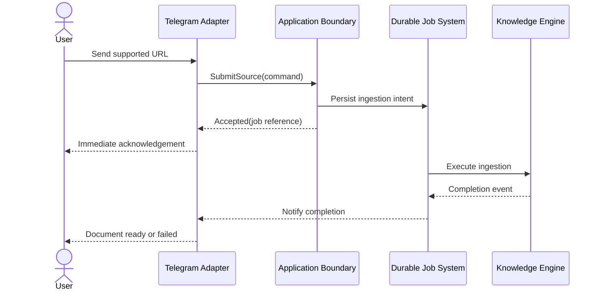
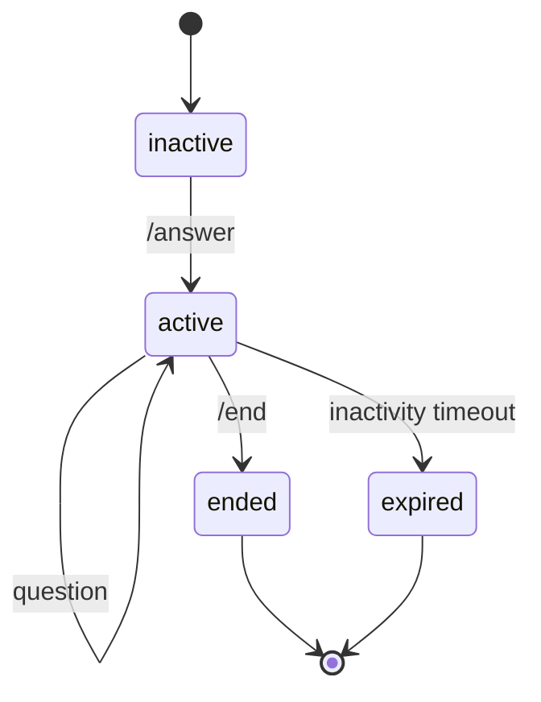

# Clients and Session Management

## Why this document exists

Telegram is the first user interface but must not define the product. This document establishes the thin-client boundary, application contracts, and lifecycle of temporary conversational state.

## Client architecture

The acknowledgement means the command was durably accepted, not that extraction succeeded.

## Stable application operations

Conceptual application contracts include:

- `SubmitSource`
- `GetIngestionStatus`
- `StartQuestionSession`
- `AskQuestion`
- `EndQuestionSession`
- `GetDocument`
- administrative `RebuildProjections`

Commands carry:

- authenticated principal and knowledge-space identity;
- client request or idempotency identifier;
- correlation/trace context;
- command-specific input;
- client capability hints only when presentation materially differs.

Results use domain outcomes rather than Telegram message strings.

## Telegram adapter responsibilities

The Telegram adapter:

- verifies update authenticity according to deployment mode;
- maps Telegram user/chat identity to an authorized principal;
- deduplicates updates;
- recognizes `/answer`, `/end`, and source submissions;
- calls application operations;
- acknowledges accepted ingestion quickly;
- formats answers and citations within Telegram constraints;
- delivers asynchronous completion or failure notifications;
- applies client-level rate and message-size handling.

It must not:

- recognize Substack or Medium through hard-coded business policy;
- fetch or extract content;
- write vault files;
- access embedding or vector providers;
- assemble retrieval context or prompts;
- store authoritative conversation history;
- decide whether an answer is sufficiently grounded.

URL recognition in the adapter is limited to routing plausible input to `SubmitSource`; authoritative support decisions belong to the engine.

## Telegram behavior

### Implemented ingestion behavior

The Telegram role currently uses Bot API long polling. It persists the next
update offset in PostgreSQL, accepts only private messages from explicitly
allowlisted numeric user IDs, extracts the first plausible URL, and delegates
authoritative classification and submission to the Knowledge Engine. The update
ID is the idempotency key.

Long polling is a deployment adapter, not a product boundary. A webhook adapter
can replace it later without changing ingestion jobs or the worker.

### Source submission

1. User sends a URL.
2. Adapter submits it with the Telegram update ID as an idempotency input.
3. Engine returns accepted, already-known, unsupported, or rejected.
4. Adapter immediately confirms durable acceptance or explains rejection.
5. Completion events are delivered asynchronously.

Repeated Telegram updates must not create duplicate documents or duplicate jobs. Notification attempts have their own idempotency identity.

### Question mode

- `/answer` starts a new session or returns the existing active session according to idempotency policy.
- Ordinary messages in an active session become questions.
- `/end` ends the session and triggers deletion of temporary history.
- An inactivity timeout provides a safety net when `/end` is never sent.
- A question outside Question Mode receives guidance rather than implicitly creating durable state.

### Implemented Question Mode

- `/answer` creates or resumes one active session for the authorized Telegram
  principal.
- Non-URL text inside the session is sent to the Knowledge Engine question
  service.
- Answers include validated evidence markers and a rendered source list.
- Telegram messages longer than one platform message are split safely; only the
  first part replies to the triggering message.
- `/end` deletes the session row and its turns through cascading deletion.
- Expired sessions are deleted by the polling process using the configured TTL.
- Replayed Telegram message IDs reuse the already stored answer rather than
  incurring duplicate model calls.

URLs continue to route to ingestion even while Question Mode is active.

## Session ownership

The Knowledge Engine session service owns:

- session identifiers and status;
- association with principal, knowledge space, and originating client;
- ordered temporary turns;
- bounded recent context or a replaceable summarized context;
- expiration and deletion;
- concurrency control for simultaneous messages;
- privacy-aware diagnostic metadata.

The session store is replaceable and uses time-to-live enforcement plus explicit deletion. It is not part of the canonical vault.

## Conversation state policy

Temporary session data may contain:

- user questions;
- assistant answers;
- structured citation references;
- minimal query-rewrite context;
- pipeline version and latency metadata needed for evaluation.

It must not contain raw provider secrets or unrestricted internal prompts. Retrieved document content should be referenced where possible rather than duplicated indefinitely.

On `/end`:

1. Mark the session closed to reject concurrent new turns.
2. Complete or cancel in-flight work according to policy.
3. Delete turn content and derived summaries.
4. Retain only minimized operational counters or audit facts allowed by retention policy.
5. Confirm completion to the client.

TTL cleanup uses the same deletion path. Deletion failures are observable and retried.

## Ordering and concurrency

Messages can arrive duplicated or out of order. Each session uses:

- a monotonically ordered turn sequence;
- idempotency by client message ID;
- optimistic concurrency or a short-lived session lock;
- explicit handling of an overlapping `/end`;
- bounded queues per principal to prevent resource exhaustion.

## Future clients

A new client adapter should need only:

- identity and authorization mapping;
- translation to application commands;
- presentation of structured results and citations;
- optional delivery of asynchronous events;
- client-specific limits and transport security.

It should not require a fork of ingestion or answer logic.

## Trade-offs

### Explicit Question Mode

Explicit sessions make data retention and user intent clear, and reduce accidental model usage. They add one command to the interaction but establish a clean lifecycle.

### Engine-owned session storage

Central ownership keeps behavior consistent across clients and enables cross-client evolution. It adds a stateful subsystem, constrained by strict TTL and deletion semantics.

## Extension points

- web streaming and rich citation previews;
- desktop deep links into Obsidian;
- REST and CLI stateless question APIs;
- client capability negotiation;
- session handoff between clients;
- optional user-approved conversation export as a new Knowledge Document;
- accessibility and localization adapters.
