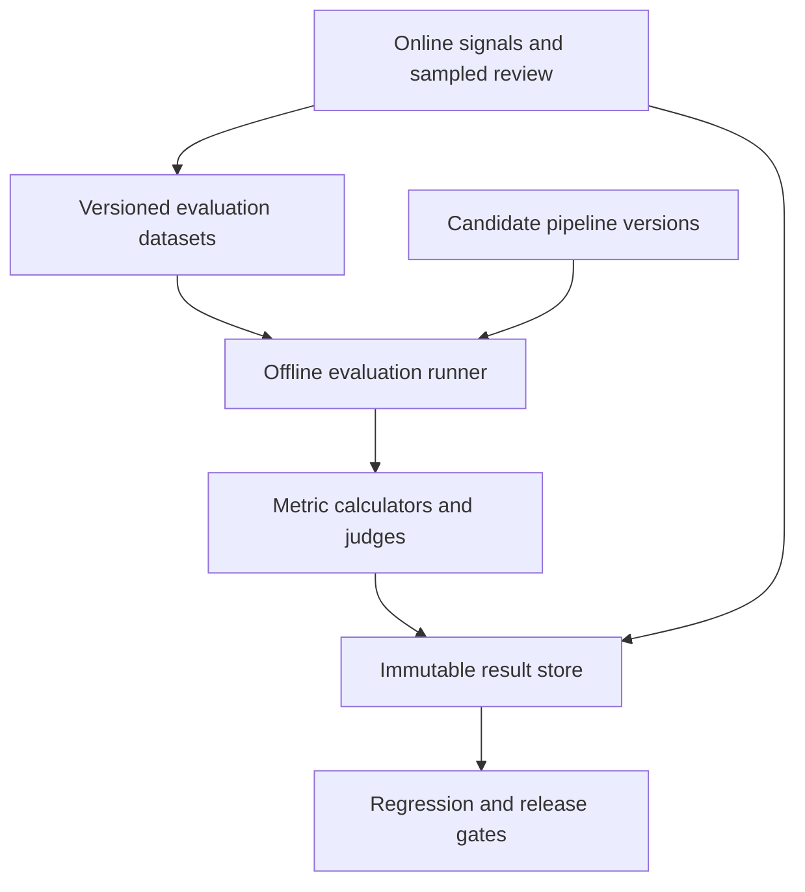

# Evaluation Architecture

## Why this document exists

Evaluation is a production subsystem, not a one-time model-selection exercise. This document defines how Knowledge Assistant measures ingestion fidelity, retrieval relevance, answer quality, citation integrity, and multi-turn behavior before and after changes.

## Evaluation principles

- Evaluate components separately and end to end.
- Prefer reproducible datasets with explicit provenance.
- Combine deterministic checks, expert labels, user feedback, and calibrated model judges.
- Version every dataset, rubric, pipeline configuration, prompt, and model.
- Compare candidates against a baseline; do not rely on isolated scores.
- Segment results by source type, language, document length, query type, and difficulty.
- Treat privacy, latency, reliability, and cost as quality dimensions.

## Evaluation architecture

Evaluation interfaces are part of the engine. A provider may implement a judge or model, but dataset schemas, rubrics, comparison logic, and release policy remain provider-independent.

## Dataset structure

An evaluation case may include:

- case ID and dataset version;
- source snapshot or licensed fixture;
- expected canonical Markdown or structural assertions;
- question and optional conversation history;
- relevant document, section, chunk, or passage labels;
- reference answer or required facts;
- expected citations and unsupported-claim traps;
- difficulty and slice labels;
- annotation provenance and confidence;
- privacy and usage constraints.

Datasets must not depend on mutable live pages for reproducibility. Copyright and data-retention policy govern what fixture content may be stored.

## Initial synthetic chunk-question dataset

The first automated retrieval dataset is built by reproducibly sampling useful chunks
from one explicit projection generation and asking a model to create structured,
standalone questions answerable from those chunks. Each generated case records the
target document, revision, chunk, content fingerprint, reference answer, required
facts, acceptable evidence identities, dataset seed, generator model, and prompt
version.

Question generation is a dataset-construction step, not part of every evaluation run.
Generated cases are reviewed, frozen in a versioned dataset, and reused for paired
baseline and candidate comparisons. Purely random regeneration would confound pipeline
changes with dataset changes.

Sampling is stratified and bounded per document. It excludes chunks that are too short,
depend on missing surrounding context, or violate dataset privacy policy. Evaluation
compares persistent chunk identities rather than query-local citation labels. Because
the same fact may occur in adjacent or duplicate evidence, reviewed cases may declare
multiple acceptable chunk identities.

Synthetic cases complement rather than replace human-authored cases. The latter remain
required for natural intent, multi-document synthesis, insufficient evidence,
conversation behavior, and adversarial retrieval.

The detailed generation schema, persistence policy, metrics, and rollout sequence are
defined in
[Monitoring, Projection Cutover, and Synthetic Evaluation Plan](./14-monitoring-and-evaluation-implementation-plan.md).

The v2 generator (`synthetic-question-v2`) writes questions as a real user would ask
them, applies deterministic lexical controls (forbidden source wording, long-phrase
reuse rejection, bounded lexical overlap), records the generator and optional
source-blind naturalizer versions plus measurable difficulty properties per case, and
supports a configurable question-style distribution. No-answer cases carry no target
chunk and are excluded from Hit@K aggregates in favor of abstention/false-positive
metrics. Legacy v1 datasets remain loadable for paired comparisons, but their circular
chunk-to-question construction is documented as biased and superseded for new datasets.

## Ingestion evaluation

Measures include:

- supported-source classification accuracy;
- fetch and extraction success rate;
- main-content precision and recall;
- title, author, date, and URL accuracy;
- structural preservation for headings, lists, quotes, links, code, and tables;
- boilerplate contamination;
- deterministic normalization;
- duplicate detection accuracy;
- malformed Markdown and schema error rate;
- conflict and retry behavior.

Golden documents provide exact or structural comparisons. Because acceptable Markdown may have equivalent forms, evaluation combines canonical checks with content-unit alignment rather than relying only on byte equality.

## Retrieval evaluation

The implemented first slice provides deterministic single-chunk sampling and reports
target rank, hit@5, hit@20, MRR, strategy route, subqueries, retrieval-call count, stop
reason, and latency. The broader measurements below are the target contract for later
dataset families and answer-level evaluation.

Measures include:

- recall at candidate depth;
- precision and normalized discounted cumulative gain at final depth;
- mean reciprocal rank for fact lookup;
- document and passage recall;
- citation-anchor resolvability;
- source diversity where multiple sources are expected;
- robustness to paraphrase, exact names, negation, and follow-up questions;
- empty-corpus and insufficient-evidence behavior;
- latency and cost by stage.

Retrieval evaluation runs independently of answer generation to expose whether failures originate before the model.

## Comparative RAG strategy evaluation

The first strategy comparison treats the implemented weighted hybrid retriever as the
baseline and evaluates vector-only, lexical-only, reciprocal rank fusion, and bounded
agentic retrieval as candidates. Candidate status does not imply production
promotion.

All paired runs pin:

- the same canonical corpus snapshot and projection generation;
- dataset cases and acceptable evidence labels;
- embedding model and dimensions;
- answer model, answer prompt, and citation validator for end-to-end runs;
- context and final evidence limits;
- environment and provider policies;
- supported random seeds and sampling parameters.

Only strategy-owned behavior changes. If a candidate requires a different embedding
or projection, both baseline and candidate generations are complete, explicitly
identified, and evaluated against the same canonical snapshot.

### Dataset families

A single-chunk synthetic dataset primarily measures direct fact lookup and is not
sufficient evidence for agentic retrieval. Comparative evaluation includes:

1. **Single-chunk fact cases** — one chunk contains the required answer.
2. **Same-document multi-chunk cases** — required facts span two or more chunks from
   one document.
3. **Cross-document synthesis cases** — answering requires evidence from multiple
   documents, including comparison, agreement, disagreement, or chronology.
4. **Lexical cases** — exact names, identifiers, quotations, and specialist terms.
5. **Semantic cases** — paraphrases whose important terms differ from the source.
6. **Ambiguous or underspecified cases** — useful query reformulation may improve
   retrieval without inventing intent.
7. **Insufficient-evidence and false-premise cases** — the correct behavior is to
   abstain, qualify, or ask for clarification.
8. **Adversarial cases** — retrieved content attempts to redirect the planner or
   weaken citation requirements.

Synthetic multi-hop cases select an evidence set before question generation. They
record required evidence groups rather than assuming one target chunk. A case succeeds
only when its configured evidence-coverage rule is satisfied.

### Strategy-specific measurements

Every strategy records the common retrieval, answer, citation, latency, and cost
metrics. RRF runs additionally record vector and lexical ranks, fused rank, RRF
constant, per-retriever candidate depth, and overlap between result lists.

Agentic runs additionally record:

- route selected by the planner;
- number of subqueries and retrieval rounds;
- evidence coverage after each round;
- planner and retrieval model calls and tokens;
- stop reason and budget-exhaustion rate;
- fallback and planner-failure rate;
- latency and cost amplification relative to weighted hybrid;
- quality gain on multi-hop and ambiguous slices;
- regression on simple questions that should not require planning.

### Promotion policy

RRF may replace weighted score fusion only if it improves or preserves required
quality slices without violating latency or operational gates. Bounded agentic
retrieval is promoted per route or query slice, not solely from a higher aggregate
score. Its improvement on complex cases must justify its additional calls, latency,
cost, nondeterminism, and failure surface.

The recommended experiment order is vector-only and lexical-only ablations, current
weighted hybrid baseline, RRF hybrid, then bounded agentic retrieval. This isolates
which improvement comes from retrieval fusion and which requires model-directed
planning.

## Answer quality evaluation

Rubric dimensions include:

- factual correctness relative to evidence;
- groundedness and absence of unsupported claims;
- completeness for the stated question;
- relevance and concision;
- appropriate uncertainty;
- synthesis across sources;
- handling of disagreement;
- instruction-following and safety;
- clarity for the target client.

Model judges must use fixed rubrics, structured outputs, blinded candidate order, and periodic calibration against human labels. Judge disagreement and variance are recorded.

## Citation evaluation

Measures include:

- citation validity: reference resolves to retrieved evidence;
- citation correctness: evidence supports the associated claim;
- citation completeness: material claims have citations;
- citation precision: irrelevant sources are not attached;
- source attribution accuracy;
- anchor stability after benign document changes;
- client rendering correctness.

Citation checks include adversarial cases where plausible but unsupported citations would be easy to fabricate.

## Conversation evaluation

Multi-turn cases test:

- follow-up resolution;
- preservation of user intent;
- topic shifts;
- correction after misunderstanding;
- avoidance of context leakage between sessions or users;
- bounded context behavior;
- `/end` and expiry deletion semantics;
- consistent citations across turns;
- resistance to instructions embedded in retrieved content.

## Offline workflow

For every material pipeline change:

1. Pin candidate and baseline version envelopes.
2. Run deterministic unit and contract suites.
3. Run affected component datasets.
4. Run a representative end-to-end suite.
5. Calculate paired deltas and confidence intervals where appropriate.
6. Inspect slice regressions, not only global averages.
7. Record quality, latency, error-rate, and cost changes.
8. Apply release gates and require review for approved exceptions.

Changes requiring evaluation include extractor, normalizer, chunker, embedding model, index settings, query rewriting, reranking, context assembly, prompts, generation models, and citation validation.

## Online evaluation

Online evaluation complements offline tests through:

- explicit user feedback linked to version envelopes;
- behavioral signals such as repeated rephrasing or abandonment, interpreted cautiously;
- sampled, privacy-approved human review;
- production retrieval and citation health metrics;
- shadow evaluation of candidate pipelines without affecting answers;
- canary or limited rollout comparisons;
- anomaly detection by quality slice.

User content is never added to an evaluation dataset automatically. Promotion requires consent or an approved de-identification and governance process.

## Release gates

Release policy defines:

- hard invariants: no unresolved citations, no cross-user leakage, valid canonical schema;
- non-regression thresholds for key quality slices;
- maximum latency and cost deltas;
- minimum sample sizes;
- approval requirements for intentional trade-offs;
- rollback triggers after deployment.

A single aggregate score cannot override a hard safety or correctness failure.

## Result provenance

Every result records:

- code and configuration version;
- dataset and rubric version;
- model/provider identifiers;
- prompt and retrieval version;
- corpus/projection generation;
- execution environment;
- seeds or sampling parameters where supported;
- raw structured outputs needed for audit, subject to retention.

## Future extension points

- domain-specific datasets;
- multilingual evaluation;
- active-learning queues;
- pairwise human preference studies;
- automated failure clustering;
- synthetic case generation with contamination controls;
- long-term anchor stability benchmarks;
- personalized quality evaluation without weakening privacy.
