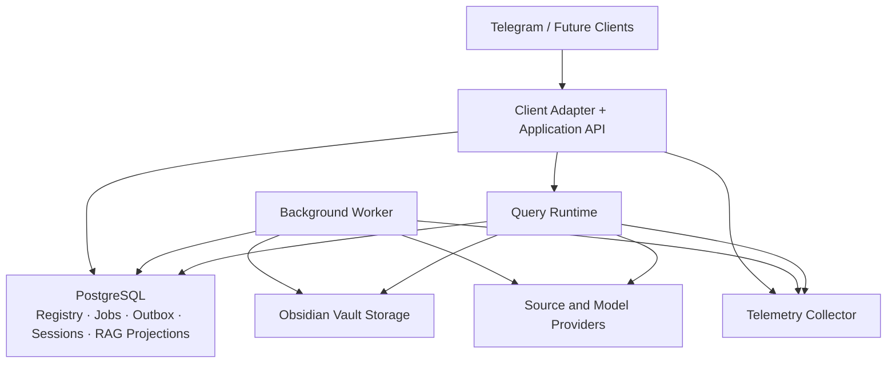

# Deployment and Evolution

## Why this document exists

Logical modularity is only useful if deployment preserves it. This document describes an initial production topology, scaling boundaries, configuration, migrations, and safe evolution without prematurely fixing a cloud or vendor.

## Initial production topology

This is a logical topology. The application API and query runtime may initially share a process. PostgreSQL is the initial shared persistence platform for registry, jobs, outbox, sessions, chunk projections, vector similarity search, and lexical search, separated by module-owned schemas or tables.

## Docker foundation

Containers are the standard local and deployable runtime unit. One immutable application image is built from the locked Python dependency graph and reused across roles.

The initial Compose foundation contains:

| Service or target | Lifecycle | Responsibility |
| --- | --- | --- |
| `postgres` | Long-running | PostgreSQL 17 with pgvector 0.8.2 and persistent derived/operational state |
| `migrate` | One-shot | Wait for database health and apply immutable schema migrations |
| `bot` | Long-running | Telegram long polling, authorization, URL submission, and immediate acknowledgement |
| `worker` | Long-running | Fetch, extract, normalize, commit, embed, index, and deliver completion notifications |
| `admin` | On-demand profile | Run redacted configuration checks and future administrative commands |
| `test` | On-demand profile | Run the deterministic test suite inside the built container environment |
| Runtime image | Reused artifact | One immutable artifact reused by migration, bot, worker, and administration roles |

Both long-running roles depend on database health and successful migration,
handle termination signals, restart unless stopped, and expose role-specific
heartbeat health checks. There is no public HTTP/API service in the current
slice.

### Container invariants

- Build dependencies are resolved from the committed lockfile with frozen resolution.
- Images use pinned Python and pgvector/PostgreSQL versions.
- The runtime executes as an unprivileged user.
- The root filesystem is read-only; only explicit mounts and bounded temporary filesystems are writable.
- Secrets are injected at runtime and excluded from image layers and build context.
- PostgreSQL is exposed only on host loopback for local development.
- Database startup is gated by `pg_isready`; migration waits for a healthy dependency.
- PostgreSQL data uses a named volume.
- The Obsidian vault is a host bind mount and is never copied into an image or Docker-managed database volume.
- Container shutdown uses an init process so future workers receive and forward termination signals correctly.

### Vault mounting

The host path configured by `KNOWLEDGE_ASSISTANT_VAULT_PATH` is mounted at `/data/vault` inside application roles. Runtime configuration is overridden to use that container path. This keeps canonical Markdown directly accessible to Obsidian and independent of container or database replacement.

For production, the vault mount and PostgreSQL storage implementation must provide the backup, concurrency, and durability properties described elsewhere in this architecture. A local bind mount is a deployment adapter, not a universal storage guarantee.

## Deployment principles

- Begin as a modular monolith with independently runnable client/API and worker roles.
- Separate interactive and background resource pools so ingestion cannot starve questions.
- Keep processes stateless except for explicitly externalized stores and the configured vault.
- Use one codebase and shared domain contracts across roles.
- Scale roles independently when measured load requires it.
- Do not split a service unless it creates a clear isolation, scaling, security, or ownership benefit.

## Environment model

At minimum:

- **local development** with disposable derived stores and a non-production vault;
- **test/evaluation** with pinned fixtures and deterministic configuration;
- **staging** with production-like topology and isolated credentials/data;
- **production** with controlled access, backups, alerts, and release gates.

Production personal data is not copied into lower environments by default.

Docker Compose is the supported local integration environment. Production may use Compose, a container orchestrator, or another platform, but it must preserve the same image, configuration, storage, health, and migration contracts.

## Configuration

Configuration is validated at startup and divided into:

- non-secret runtime settings;
- secret references;
- provider and model selections;
- feature flags;
- policy settings such as retention and supported sources;
- versioned retrieval, prompt, and evaluation configurations.

Configuration changes that affect answer or ingestion semantics receive version identifiers and evaluation. Unknown or invalid configuration fails startup rather than silently selecting defaults.

## Scaling boundaries

### Client/API

Scales with inbound updates and synchronous commands. Duplicate deliveries are expected, so horizontal scaling relies on idempotency rather than sticky routing.

### Workers

Scale by queue depth and stage-specific resource needs. Future CPU-heavy OCR or transcription may use dedicated worker pools without changing the ingestion contract.

### Query runtime

Scales by concurrent sessions and model latency. It has separate concurrency, timeout, and circuit budgets from ingestion.

### Vault

A local Obsidian vault introduces single-writer and synchronization constraints. The vault adapter must declare supported concurrency and consistency semantics. Horizontal writers require shared storage or serialized write coordination; this is not assumed safe by default.

### Derived indexes

Initially reside in PostgreSQL using vector and full-text capabilities and use versioned projection generations. They may later scale or deploy independently. Their availability never determines canonical durability.

## Release strategy

A production release progresses through:

1. static, unit, contract, and integration tests;
2. schema and migration validation;
3. offline quality evaluation against the current baseline;
4. staging smoke and recovery tests;
5. canary or limited rollout where feasible;
6. monitoring of operational, quality, and cost gates;
7. promotion or rollback.

Prompt, model, extractor, chunker, and retrieval configuration releases follow the same discipline as application code.

## Database and schema migrations

Migrations are:

- versioned and reviewed;
- backward compatible during rolling deployment where applicable;
- tested on representative data volume;
- observable and resumable for long operations;
- separated into expand, migrate/backfill, and contract phases;
- paired with rollback or forward-recovery plans.

Canonical Markdown schema migrations follow the additional requirements in the domain-model document and never depend on a live vector index.

## Projection migrations

Derived changes use generation replacement:

- create a new compatibility manifest;
- build without mutating the active generation;
- validate completeness and quality;
- switch through one active-generation pointer;
- retain a rollback generation;
- garbage-collect later.

This supports embedding-model and chunking changes without partially mixed results.

## Feature flags

Flags support controlled rollout, not permanent architectural branching. Flags:

- have an owner and expiry;
- are evaluated at defined application boundaries;
- are included in version/evaluation envelopes;
- default safely;
- do not bypass authorization, validation, or citation invariants.

## Capacity and backpressure

The system enforces:

- bounded request sizes;
- queue and concurrency limits;
- per-provider rate budgets;
- per-principal usage limits;
- interactive/background resource separation;
- load shedding before store exhaustion;
- storage growth forecasts;
- cost budgets.

User acknowledgement should state queueing without making an unbounded completion promise.

## Disaster recovery

Deployment automation must be able to recreate compute and derived stores from configuration, backups, and canonical vault data. Recovery drills measure:

- vault restore;
- registry reconciliation;
- projection rebuild duration;
- secret rotation;
- client reconnection;
- citation integrity after restore.

## Trade-offs

### Shared database initially

PostgreSQL reduces coordination and operational cost by serving both transactional workflows and the initial hybrid RAG indexes. Module ownership is preserved through schemas/repositories and prohibited cross-module table access. Query and worker connection pools and resource budgets must be isolated so expensive retrieval or index builds cannot exhaust operational transactions. Physical separation remains an option if scale, performance, or security requires it.

### Local or synchronized vault

Direct Obsidian compatibility is central but constrains multi-writer scaling. The vault port isolates these constraints and allows a future storage adapter while preserving the Knowledge Document format.

## Future evolution triggers

Consider extracting a component only when evidence shows:

- substantially different scaling characteristics;
- required fault or security isolation;
- independent release cadence;
- a dedicated ownership boundary;
- provider or language/runtime specialization that outweighs distribution cost.

Likely candidates are transcription/OCR workers, retrieval infrastructure, and public API gateways—not the core domain model.
