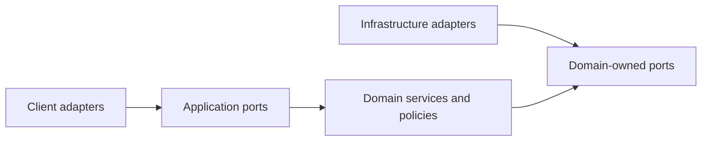
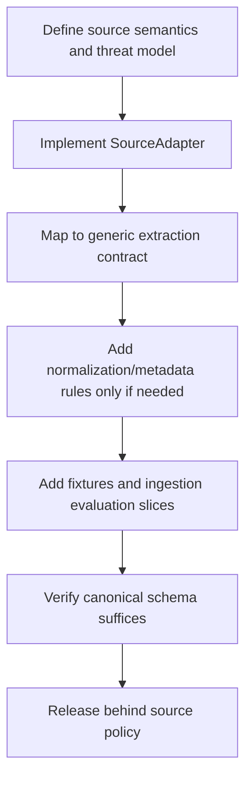

# Extension Contracts

## Why this document exists

Long-term maintainability depends on stable seams, not merely separate folders. This document defines the provider-independent capabilities that modules may depend on and the rules for adding implementations.

The names below are conceptual contracts. They constrain responsibilities and semantics without prescribing a programming language, framework, or exact method signatures.

## Dependency rule

Ports and their data contracts are owned by the Knowledge Engine. Adapters depend on those contracts. The engine never depends on adapter types or provider SDKs.

## Application ports

### Knowledge Commands

Use-case-oriented commands submit sources, manage sessions, ask questions, inspect status, delete documents, and initiate rebuilds. They define authentication, idempotency, validation, and domain outcome semantics for all clients.

### Knowledge Events

Versioned facts about completed domain transitions. Events contain stable identifiers and minimal metadata, not canonical content bodies. Consumers must tolerate duplicate delivery and compatible schema evolution.

## Ingestion ports

### `SourceClassifier`

Determines which installed source adapter can handle a Source Reference. Returns confidence and normalized source classification; never fetches content as a side effect.

### `SourceAdapter`

Resolves source identity, fetches within policy, and produces a source-neutral extraction result with provenance and warnings.

New adapters must provide:

- recognition and canonicalization tests;
- success, blocked, malformed, changed-markup, and rate-limit fixtures;
- security review of URL or binary handling;
- ingestion evaluation cases;
- normalized error mapping.

Adapters that call metered source APIs must additionally declare credential
requirements, maximum resources per ingestion, pagination/truncation policy,
usage telemetry, and operator-facing budget controls. The X adapter uses one
post lookup and at most one bounded full-archive thread search; it fails instead
of paging beyond the configured canonical-completeness limit.

### `ContentNormalizer`

Transforms extracted structure into deterministic canonical Markdown and metadata. Its version participates in revision and projection compatibility.

### `MetadataEnricher`

Adds optional deterministic or model-generated metadata with explicit provenance. It cannot overwrite higher-authority metadata without a declared conflict rule.

### `KnowledgeDocumentValidator`

Applies schema, structural, provenance, and quality gates before canonical commit.

## Persistence ports

### `VaultRepository`

Reads, stages, atomically commits, enumerates, fingerprints, and resolves canonical Knowledge Documents under a constrained root.

### `DocumentRegistry`

Coordinates document/source identity, revisions, workflow state, projection status, conflicts, and reconciliation metadata.

### `JobQueue`

Provides durable at-least-once work delivery, scheduling, retry timing, leases, and dead-letter behavior. It does not define domain retry policy.

### `EventOutbox`

Atomically records publishable domain events with registry state and supports idempotent delivery.

### `SessionStore`

Stores temporary, ordered session state with optimistic concurrency, explicit deletion, and enforced expiry.

## Derived-data ports

### `Chunker`

Produces ordered retrieval units and citation anchors from an exact Knowledge Document revision. Output is deterministic for a given version and configuration.

### `EmbeddingProvider`

Converts chunks or queries to vectors and reports model identity, dimensions, usage, and normalized failures. Batching and rate-limit behavior remain adapter concerns.

### `VectorIndex`

Writes and queries one compatible projection generation, supports metadata filtering and deletion, and exposes completeness/health information. The initial adapter uses a PostgreSQL vector extension such as pgvector.

### `LexicalIndex`

Supports exact and term-based retrieval over the same evidence identities as the vector index. The initial adapter uses PostgreSQL full-text search.

### `ProjectionCatalog`

Tracks compatibility manifests, build progress, validation, active-generation switching, and rollback generations.

## Query ports

### `QueryInterpreter`

Produces retrieval-ready queries from a user question and bounded session context.

### `CandidateRetriever`

Returns scored evidence candidates with provenance. Hybrid combination policy may be implemented by an engine service using vector and lexical ports.

### `RetrievalStrategy`

Coordinates one complete evidence-acquisition policy behind a versioned contract. A
strategy may call one retriever once, fuse multiple deterministic rankings, or use a
bounded planner to issue several subqueries. It returns final evidence plus strategy
provenance: route, ranks, subqueries, rounds, stop reason, latency, and usage.

Strategies cannot generate the final answer, weaken citation policy, modify canonical
knowledge, or access arbitrary tools. They obey engine-owned candidate, context,
latency, token, cost, and retry budgets. Deterministic fakes must be available for
contract and orchestration tests.

### `Reranker`

Reorders provided candidates and returns calibrated-within-version scores and usage metadata.

### `ContextAssembler`

Selects and labels a bounded evidence bundle while preserving provenance and instruction/data separation.

### `AnswerGenerator`

Returns a structured answer with claim-to-evidence references, usage, and model/prompt identity. It cannot access stores or tools independently.

### `CitationValidator`

Validates claim support and anchor integrity and returns a typed disposition.

## Operational ports

### `Telemetry`

Creates spans, emits bounded-cardinality metrics, and writes structured, redacted events. Domain execution must remain correct if export is temporarily unavailable.

### `Clock` and `IdentifierFactory`

Provide controllable time and identity for deterministic testing. Production adapters supply secure, collision-resistant values.

### `SecretProvider`

Resolves scoped credentials without exposing them to domain code or logs.

### `PolicyProvider`

Supplies validated retention, provider, source, and budget policies. Policy changes are versioned when they affect semantics.

## Contract design rules

All public contracts must:

- use domain types rather than provider response objects;
- define success, rejection, retryable failure, permanent failure, and cancellation;
- support deadlines and cancellation;
- carry correlation and version metadata where relevant;
- avoid leaking filesystem paths or vendor query syntax;
- document idempotency and ordering;
- define privacy classification for fields;
- be testable with an in-memory or deterministic fake;
- evolve compatibly or receive a new version.

## Conformance testing

Every adapter passes a shared contract suite plus provider-specific tests. Contract suites verify:

- error normalization;
- timeout and cancellation behavior;
- idempotency where promised;
- metadata and version reporting;
- privacy-safe telemetry;
- pagination/batching semantics;
- malformed and boundary input behavior.

Live-provider tests are separate from deterministic CI fixtures and run on a controlled schedule or environment.

## Adding a new source type

If the canonical schema cannot express a source feature such as PDF pages or transcript timestamps, evolve the generic citation/provenance model rather than adding client- or provider-specific fields to unrelated modules.

## Adding a new client

A new client implements identity mapping, command translation, event delivery, and result rendering. It reuses Knowledge Commands, Knowledge Events, session policy, and structured citations.

## Replacing a provider

A replacement must:

1. satisfy the same port contract;
2. pass conformance tests;
3. declare a new compatibility/version identity;
4. pass relevant offline evaluations;
5. meet privacy, security, latency, and cost requirements;
6. use a migration or parallel projection when outputs are incompatible.

## Extension trade-offs

Ports add types and translation work. They should exist at boundaries with credible variability or important test seams, not wrap every internal function. Internal modules may use direct calls while preserving their published ownership boundaries.

## Anticipated extensions

- PDF parsers with page and bounding-box anchors;
- podcast and video transcription with timestamps and speakers;
- OCR and image evidence;
- local models and indexes;
- richer metadata enrichment;
- graph retrieval;
- multiple vaults and principals;
- web, desktop, REST, and CLI clients;
- pluggable evaluation judges and telemetry backends;
- vector-only, lexical-only, weighted-fusion, reciprocal-rank-fusion, and bounded
  agentic retrieval strategies.
