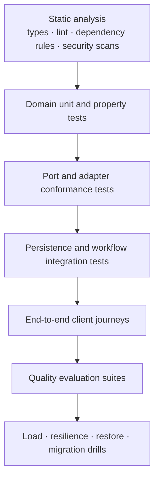

# Verification Strategy

## Why this document exists

Evaluation measures product quality, while software verification proves that architectural invariants and component contracts behave correctly under normal and adverse conditions. This document defines the test strategy required before production implementation can be considered complete.

## Verification principles

- Test the smallest boundary that can prove a behavior.
- Keep domain tests deterministic and provider-independent.
- Use shared conformance suites for every adapter.
- Test retries, duplicates, cancellation, and partial failure as normal cases.
- Verify canonical and operational state, not only returned responses.
- Reserve live-provider tests for behaviors that fixtures cannot prove.
- Treat observability, privacy, restore, and migration behavior as testable requirements.

## Test layers

The diagram represents increasing scope, not a requirement to run every layer serially.

## Domain tests

Fast tests cover:

- source and document identity rules;
- state-machine transitions;
- frontmatter schema and migrations;
- normalization invariants;
- metadata precedence;
- citation-anchor construction and resolution;
- retry classification;
- session ordering, end, and expiry;
- policy decisions and authorization;
- version compatibility.

Property-based tests are appropriate for URL normalization, path sanitization, idempotency, schema round-trips, and arbitrary Markdown structures.

## Contract tests

Each port has an owner-provided conformance suite. An adapter cannot be considered supported until it passes the suite.

Examples:

- vault adapters prove atomic commit, conflict detection, enumeration, and path containment;
- source adapters prove error mapping, redirect policy, content limits, and fixture extraction;
- vector adapters prove generation isolation, filters, deletion, and stable evidence identity;
- session stores prove ordering, optimistic concurrency, TTL, and deletion;
- model adapters prove timeout, cancellation, version/usage reporting, and malformed-response handling;
- job adapters prove at-least-once behavior, leases, retry scheduling, and dead-letter semantics.

## Integration tests

Integration environments use real storage engines where semantics matter. They cover:

- registry intent, file commit, and outbox recovery;
- worker crash between every durable ingestion transition;
- duplicate and concurrent submissions;
- partial projection builds and active-generation switching;
- registry/vault drift and reconciliation;
- session deletion failures and retries;
- client notification failure after successful ingestion;
- transaction isolation and migration behavior.

Tests inject failures at boundaries deliberately rather than relying on incidental outages.

## End-to-end journeys

Critical journeys include:

1. Submit a supported article, receive immediate acknowledgement, and later receive completion.
2. Resubmit the same unchanged article without duplicating knowledge.
3. Ingest an updated article as a new revision.
4. Protect a user-edited document during refresh.
5. Start Question Mode, ask a question and follow-up, receive valid citations, then end and verify deletion.
6. Reject unsupported or unsafe URLs with a stable outcome.
7. Recover an ingestion job after worker termination.
8. Serve queries from the prior projection while a new generation builds.
9. Delete a document and verify it disappears from every retrieval path.

Client-level tests verify translation and formatting but reuse the same engine journey specifications across Telegram and future clients.

## Fixtures and golden artifacts

Test assets include:

- captured, policy-approved source fixtures;
- canonical golden Knowledge Documents;
- malformed and adversarial HTML/Markdown;
- redirect and network-policy cases;
- source markup variants;
- model response fixtures;
- registry and schema migration snapshots;
- retrieval corpora with relevance labels.

Fixtures are immutable within a version. Updating a golden artifact requires review of the semantic difference, not an automatic snapshot refresh.

## Non-functional verification

### Performance and load

Measure acknowledgement latency, ingestion throughput, queue recovery, interactive latency percentiles, index rebuild duration, and storage growth under representative volume.

### Resilience

Exercise provider timeouts, rate limits, queue redelivery, worker loss, index outage, telemetry outage, disk pressure, and stale projection states. Verify bounded retries and absence of canonical corruption.

### Security

Test authorization isolation, webhook verification, SSRF defenses, redirect rebinding, path traversal, symlink handling, oversized payloads, secret redaction, prompt injection, and malicious model output.

### Privacy

Verify session deletion, TTL cleanup, telemetry redaction, provider payload minimization, cache eviction, and document deletion propagation.

### Recovery

Restore the vault and operational database, rebuild all projections, reconcile identities, and rerun a retrieval/citation evaluation against the restored system.

## Continuous integration gates

Every change runs:

- formatting, linting, type checks, and dependency-boundary checks;
- deterministic unit and property tests;
- adapter contract tests not requiring live credentials;
- integration tests with ephemeral stores;
- security and secret scans;
- changed-scope quality evaluations.

Release pipelines add full evaluation, migration validation, end-to-end staging journeys, artifact provenance, and rollback verification.

Flaky tests are treated as defects. Quarantine is time-bounded, owned, and visible; it cannot silently remove coverage from a release gate.

## Container verification

Container changes require:

- static validation of the Compose model;
- a frozen, network-reproducible application image build;
- execution of the full test suite in the image's test target;
- verification that migration SQL is packaged in the runtime image;
- startup of PostgreSQL and successful migration from an empty volume;
- a second migration run proving idempotency;
- verification of the installed pgvector extension;
- checks that the runtime user is non-root and the root filesystem is read-only;
- confirmation that `.env`, local vault content, virtual environments, and repository metadata are absent from image layers;
- graceful termination tests when long-running API and worker roles exist.

CI may cache dependency and image layers, but release verification must remain correct with an empty cache.

## Live dependency testing

Scheduled or pre-release tests verify actual source and model providers with controlled accounts and budgets. They:

- use non-personal test data;
- observe provider terms and rate limits;
- distinguish provider failure from product regression;
- alert on source markup drift;
- do not make routine CI depend on unstable internet behavior.

## Architecture enforcement

Automated checks should prevent:

- domain modules importing client or vendor adapters;
- clients accessing vault, registry internals, or retrieval stores;
- cross-module persistence access that bypasses owning repositories;
- unversioned prompts, schemas, or projection configurations;
- telemetry calls with prohibited content fields;
- derived writes without revision and compatibility identity.

## Evidence of production readiness

A release is production-ready only when it provides:

- passing functional and quality gates;
- documented residual risks and approved exceptions;
- tested migrations and rollback;
- observable critical journeys;
- actionable runbooks and alerts;
- verified backups and a recent restore drill;
- cost and capacity results within budget;
- traceable build, configuration, model, and prompt versions.

## Interaction with evaluation

[Evaluation Architecture](./08-evaluation-architecture.md) owns semantic quality measures and regression datasets. This document owns software behavior, integration guarantees, and operational verification. Release decisions require both.

## Future extension points

- model-based test generation with reviewed assertions;
- continuous source-markup drift detection;
- formal state-machine checking;
- fault-injection environments;
- cross-platform vault compatibility suites;
- multi-user isolation and noisy-neighbor tests.
